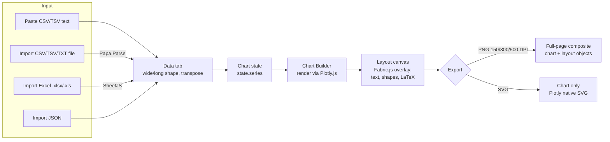
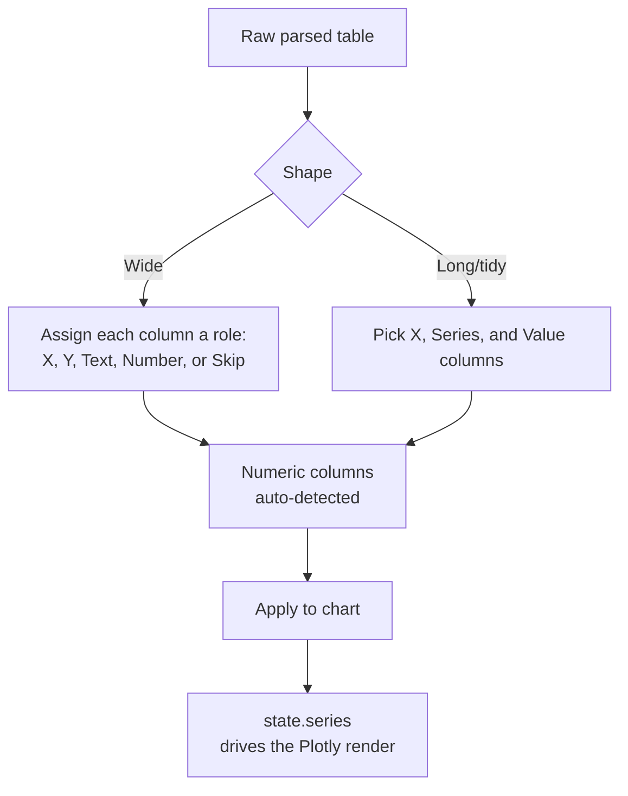
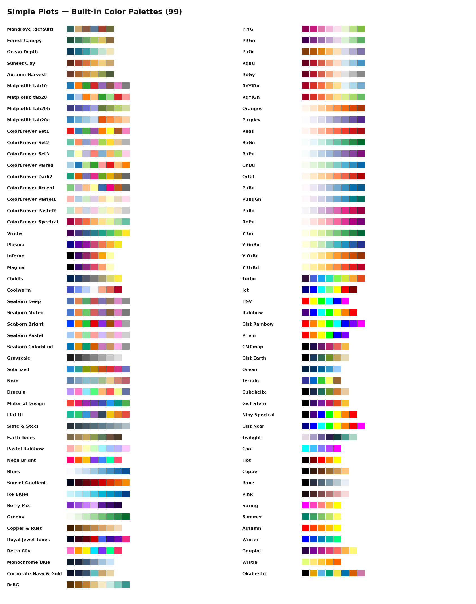

# Ploots Click

A single-page, no-backend chart builder for publication-ready figures — paste your data, style it, lay it out, and export print-quality PNG/SVG. 100% client-side, hosted free on **GitHub Pages**.


-1B3E6F?logo=latex&logoColor=white)


**🔗 apps: [defani.github.io/Ploots-click](https://defani.github.io/Ploots-click/)**

## Table of Contents

- [What is this?](#what-is-this)
- [Interface](#interface)
- [Features](#features)
  - [Charts](#charts)
  - [Function Plot Studio (standalone)](#function-plot-studio-standalone)
  - [Page layout & annotation](#page-layout--annotation)
  - [Export](#export)
- [Architecture](#architecture)
- [Project structure](#project-structure)
- [LaTeX & Symbol Catalog](#latex--symbol-catalog)
- [Color Palettes — sources & licensing](#color-palettes--sources--licensing)
- [Fonts — sources & licensing](#fonts--sources--licensing)
- [Icons — sources & licensing](#icons--sources--licensing)
- [Page templates](#page-templates)
- [Fill patterns, dash styles & data-point markers](#fill-patterns-dash-styles--data-point-markers)
- [Layout shape library](#layout-shape-library)
- [Export details](#export-details)
- [Value label formatting](#value-label-formatting)
- [Error bars](#error-bars)
- [Keyboard shortcuts](#keyboard-shortcuts)
- [Libraries & versions](#libraries--versions)
- [Known limitations](#known-limitations)
- [Built with](#built-with)
- [License](#license)
- [Purpose & Acknowledgements](#purpose--acknowledgements)
- [Feedback & Contributions](#feedback--contributions)
- [Author](#author)

## What is this?

Ploots Click is a **client-side-only web app**: open the page (or visit the GitHub Pages link below) and everything — data parsing, chart rendering, page layout, and export — happens locally in your browser tab. Nothing you paste or upload is ever sent to a server, because there is no server. The app is just static HTML, CSS, and JavaScript, deployed straight from this repository via GitHub Pages, which is why it costs nothing to run and needs zero setup.

[⬆️ Back to Table of Contents](#table-of-contents)

## Interface


Live app: **[defani.github.io/Ploots-click](https://defani.github.io/Ploots-click/)**

[⬆️ Back to Table of Contents](#table-of-contents)

## Features

### Charts
- **18 chart types**: single bar, grouped bar, stacked bar, lollipop, line, area, scatter, pie, donut, histogram, box plot, violin plot, heatmap, waterfall, funnel, treemap, choropleth map, radial rings (multi-track)
- **Lollipop**: thin stem (baseline → value) with a marker head, single or grouped side-by-side per category, both orientations — a real Plotly trace pair under the hood, so it exports exactly like every other chart type
- **Choropleth map**: one value per country (ISO-3 code or country name), colored by the active palette as a continuous scale; the map-only Plotly bundle is lazy-loaded on first use so it doesn't add to the initial page weight
- **Radial rings (multi-track)**: circular category plot in the style of multi-genome COG/functional-category figures — categories become angular sectors (width ∝ average share), each series becomes a concentric track (bar length ∝ that series' share of the category), with outside labels and a leader line per sector. Drawn as plain SVG rather than a Plotly trace, so it has its own SVG/PNG export path instead of Plotly's
- **Data input**: paste tab- or comma-separated data, or import a file directly — **CSV/TSV/TXT** (parsed with Papa Parse, so quoted fields, embedded commas, and escaped quotes are all handled correctly), **Excel** (`.xlsx`/`.xls`, including multi-sheet workbooks, via SheetJS), or **JSON** (array-of-objects or 2D array), as well as pasted CSV/TSV or JSON text
- **Dedicated Data tab**: work on a table separate from the applied chart data — transpose rows/columns, switch between **wide** (assign each column a role: X, Y, Text, Number, or Skip) and **long/tidy** shape (pick the X, Series, and Value columns), with numeric columns auto-detected, before applying the result to the chart
- **Per-series controls**: toggle visibility, pick a custom color, rename the series label, choose a fill pattern, and send any series to a **secondary Y-axis** (bar/line/area/scatter)
- **Visual style modes**: Color, Color + Pattern, or Pattern (grayscale), backed by 8 hatch/fill patterns, so figures stay readable in print or black-and-white
- **49 built-in color palettes**: Matplotlib (tab10/20/20b/20c), ColorBrewer (Set1-3, Paired, Dark2, Accent, Pastel1-2, Spectral), perceptual scales (Viridis, Plasma, Inferno, Magma, Cividis, Coolwarm), Seaborn (Deep, Muted, Bright, Pastel, Colorblind), popular editor themes (Nord, Dracula, Solarized, Material Design, Flat UI), plus a set of custom earth-tone, jewel-tone, and gradient palettes

 
- **Typography**: a curated set of 5 fonts (Cambria, Times New Roman, Arial, Poppins, Cambria Math — served via Google Fonts) with separate controls for the title/subtitle and for the chart body/axes/legend
- **Title & subtitle**: independent font, size, bold/italic, and alignment controls, plus an adjustable spacing gap between the title and subtitle
- **Axis range control**: auto (fit to data) or custom min/max, independently for X and Y, plus a dedicated label for the secondary axis
- **Legend controls**: show/hide, 7 position presets (top-left/center/right, bottom-center, left/right-middle, inside top-right), 1 to 4 columns, an optional legend title, adjustable font size, and an optional border box
- **Line thickness controls**: independently adjustable chart frame border width and axis line width
- **Outline controls**: marker/bar outline toggle, plus an optional full frame border around the chart
- **Bar spacing controls**: bar gap, bar-group gap, and bar width, in a collapsible panel
- **Value labels**: show or hide data values directly on the chart, with formatting options (auto, integer, 1 or 2 decimals, thousands separator, percent, currency)
- **Error bars**: percent-of-value or fixed-amount error bars, applied uniformly across all visible series on bar/line/area/scatter charts
- **Custom dimensions**: set the exact chart width and height in pixels

### Function Plot Studio (standalone)
A third, fully independent view (alongside Layout and Data) for plotting
math functions on their own - not tied to the chart's data/series at all.
Toggle it from the calculator icon in the left nav.
- **5 function kinds**: explicit `y = f(x)`, parametric `x(t), y(t)`, polar
  `r(\theta)`, implicit `f(x,y) = g(x,y)` (rendered as a zero-level contour),
  and piecewise (multiple formula/condition pairs, tried top to bottom)
- **Live KaTeX preview** of the formula as you type it, above the add button
- **Own canvas, own axis range** (auto-fit or manual min/max per axis),
  gridline toggle, and an equal-aspect-ratio (1:1) toggle for geometrically
  accurate circles/implicit curves
- **Own PNG/SVG export**, independent of the main chart's export settings
- Multiple functions at once, each with its own color, visibility toggle,
  and delete button - same list-based UI as the chart-linked Function Plot
  panel below
- Reuses the same LaTeX-ish input and math.js evaluation engine as the
  chart-linked panel, so `\frac`, `\sqrt`, `\sin/\cos/...`, `^`, `\pi`,
  `\theta`, `\cdot`, `\ln`/`\log`, and implicit multiplication all work
  the same way in both places

### Page layout & annotation
- **Full-page canvas**, separate from the chart block itself — position and resize the chart anywhere on the page
- **10 built-in page templates** (A4/Letter/Legal landscape & portrait, 16:9 and 4:3 presentation, Instagram Story, social square) plus fully custom width/height in px, mm, or cm
- **Drafting-style rulers** on all four sides of the canvas, unit-aware and zoom-aware, that also double as a source for **draggable guide lines**
- **Layout objects** on top of the chart, built with Fabric.js: text boxes, rectangles, ellipses, and lines, each with its own format bar (color, fill, stroke, alignment), plus lock, duplicate, delete, and a right-click context menu
- **LaTeX & symbol tool**: type formulas in `$...$` and see them rendered live, straight onto the canvas, via MathJax (e.g. `$R^2 = 0.95$`, `$CO_2$`), with adjustable color, size, and font, a history of recent formulas, ready-made templates, and a built-in Ω symbol/unit catalog (area & volume, rate/flux, mass & concentration, temperature & misc, stats & chemistry) usable from any text field, including axis labels

### Export
- **PNG** at 150, 300, or 500 DPI — a full-page composite of the background, the chart, and every layout object, exactly as shown in the editor
- **SVG** export of the chart itself
- **Zero install for users**: Plotly.js is bundled locally; Fabric.js, MathJax, KaTeX, math.js, Papa Parse, SheetJS, AG Grid, jStat, marked, Google Fonts, and Material Symbols all load from CDN — no build step, no server, no signup required

[⬆️ Back to Table of Contents](#table-of-contents)

## Architecture

Everything below happens in a single browser tab — there's no backend, no build step, and no network call other than fetching static assets from a CDN.

**High-level data flow**, from raw input to exported file:



> GitHub renders Mermaid with raw HTML/`` stripped from node labels, so logos can't sit *inside* the boxes above — this legend maps each engine to its stage instead:

| Stage | Engine |
|---|---|
| CSV/TSV parsing |  |
| Excel import |  |
| Chart rendering |  |
| Layout canvas / shapes / text |  |
| LaTeX formulas on canvas |  |

**Data tab: wide ↔ long/tidy conversion**, the step between raw parsed rows and the chart's series:



[⬆️ Back to Table of Contents](#table-of-contents)

## Project structure

```
.
├── index.html                     # App shell, styling, CDN <script>/<link> tags, splash screen
├── js/
│   ├── chart-builder/             # Chart engine, split into 13 numbered load-order files
│   │   ├── 01-config.js           #   static config: fonts, canvas templates, hatch/dash/marker defs
│   │   ├── 02-state.js            #   shared mutable state object, sample dataset, default colors
│   │   ├── 03-ui-lists.js         #   populates font/template/unit pickers in the sidebar
│   │   ├── 04-data.js             #   parses pasted/CSV data into state.series, renders series list UI
│   │   ├── 05-style-helpers.js    #   legend layout, color/pattern modes, value formatting, error bars
│   │   ├── 06-canvas-units.js     #   canvas size <-> unit conversion, style toggle visibility
│   │   ├── 07-render.js           #   the main render() function that builds/draws the Plotly chart
│   │   ├── 08-helpers-export.js   #   string/color helpers, PNG/SVG export
│   │   ├── 09-event-wiring.js     #   wires sidebar controls (style, axes, legend, ranges, export)
│   │   ├── 10-view-switcher-init.js # Layout/Data/Function view switcher, boots the chart on load
│   │   ├── 11-choropleth.js       #   Choropleth Map chart type; lazy-loads the Plotly geo bundle on first use
│   │   ├── 12-radial-rings.js     #   Radial Rings chart type; hand-drawn SVG + its own SVG/PNG export path
│   │   └── 13-lollipop.js         #   Lollipop chart type; stem + marker-head Plotly traces, grouped like bar-group
│   ├── layout-editor/             # Fabric.js full-page canvas, split into 16 numbered files
│   │   ├── 01-canvas-core.js      #   Fabric.js canvas setup, chart-proxy sync, stage resize
│   │   ├── 02-toolbar-text.js     #   main toolbar wiring, "Add text" tool
│   │   ├── 03-shapes.js           #   shape picker and shape geometry helpers
│   │   ├── 04-images.js           #   "Add image" tool (drop a raster image onto the canvas)
│   │   ├── 05-object-actions.js   #   lock/unlock, duplicate, delete
│   │   ├── 06-context-menu.js     #   right-click context menu
│   │   ├── 07-selection.js        #   selection events, object-type checks, format-bar show/hide
│   │   ├── 08-format-bars.js      #   wires topbar format bars (text/shape/math) to the active object
│   │   ├── 09-panels-helpers.js   #   color-swatch helpers, side-panel sync
│   │   ├── 10-export-overlay.js   #   flattens all Fabric objects to a transparent PNG for export
│   │   ├── 11-sidebar-nav.js      #   left sidebar panel open/close/switch logic
│   │   ├── 12-theme-init.js       #   dark/light theme toggle, final boot calls
│   │   ├── 13-axis-title-detach.js #  detach X/Y axis titles into free-floating Fabric text
│   │   ├── 14-legend-hover.js     #   drag the chart legend without unlocking layout elements first
│   │   ├── 15-legend-detach.js    #   detach the legend into a free-floating Fabric.js group
│   │   └── 16-draw-tool.js        #   freehand Draw tool (Pen / Highlighter / Marker / Eraser)
│   ├── undo_redo.js               # Global undo/redo history stack for the whole app
│   ├── canvas_ruler.js            # Drafting-style rulers on all 4 sides + draggable guide lines
│   ├── color_picker.js            # Reusable HSV/RGB/HEX color picker used throughout the sidebar
│   ├── palettes.js                # Built-in color palette catalog, grid, and search
│   ├── function_plot.js           # Chart-linked Function Plot sidebar panel (y = f(x) over the chart)
│   ├── standalone_function_plot.js # Function Plot Studio: standalone explicit/parametric/polar/implicit/piecewise plotter + KaTeX preview
│   ├── latex_symbols.js           # LaTeX (MathJax) formulas on canvas + the Ω symbol/unit catalog
│   ├── data_view.js               # Data tab: wide/long shape, transpose, column-role assignment
│   └── data_stats.js              # Data View column statistics (powered by jStat)
├── vendor/
│   └── plotly-cartesian.min.js    # Bundled Plotly.js (bar, box, heatmap, histogram, pie, scatter, violin, etc.)
├── assets/
│   ├── logo_light.png             # Light-topbar logo mark
│   ├── logo_dark.png              # Dark-topbar logo mark
│   └── palettes.png               # Palette catalog preview image (used in this README)
├── LICENSE                        # MIT license
├── THIRD-PARTY-NOTICES.md         # Bundled Plotly.js's own MIT notice
└── README.md
```
### LaTeX & Symbol Catalog

The formula box (`$...$`) is rendered live via **MathJax**, so any valid LaTeX math syntax works there, not just what's listed below. The **104-symbol catalog** is a curated, one-click subset for the symbols and units that come up most often in scientific figures — searchable by name or LaTeX code, and insertable directly onto the canvas without typing.

<details>
<summary><strong>Greek</strong> (34)</summary>

| Symbol | Name | LaTeX |
|:---:|---|---|
| α | alpha | `\alpha` |
| β | beta | `\beta` |
| γ | gamma | `\gamma` |
| δ | delta | `\delta` |
| ε | epsilon | `\epsilon` |
| ζ | zeta | `\zeta` |
| η | eta | `\eta` |
| θ | theta | `\theta` |
| ι | iota | `\iota` |
| κ | kappa | `\kappa` |
| λ | lambda | `\lambda` |
| μ | mu | `\mu` |
| ν | nu | `\nu` |
| ξ | xi | `\xi` |
| π | pi | `\pi` |
| ρ | rho | `\rho` |
| σ | sigma | `\sigma` |
| τ | tau | `\tau` |
| υ | upsilon | `\upsilon` |
| φ | phi | `\phi` |
| χ | chi | `\chi` |
| ψ | psi | `\psi` |
| ω | omega | `\omega` |
| Γ | Gamma | `\Gamma` |
| Δ | Delta | `\Delta` |
| Θ | Theta | `\Theta` |
| Λ | Lambda | `\Lambda` |
| Ξ | Xi | `\Xi` |
| Π | Pi | `\Pi` |
| Σ | Sigma | `\Sigma` |
| Υ | Upsilon | `\Upsilon` |
| Φ | Phi | `\Phi` |
| Ψ | Psi | `\Psi` |
| Ω | Omega | `\Omega` |
</details>

<details>
<summary><strong>Operators</strong> (26)</summary>

| Symbol | Name | LaTeX |
|:---:|---|---|
| ± | plus-minus | `\pm` |
| ∓ | minus-plus | `\mp` |
| × | times | `\times` |
| ÷ | divide | `\div` |
| · | dot product | `\cdot` |
| √ | square root | `\sqrt{}` |
| ∑ | summation | `\sum_{i=1}^{n}` |
| ∏ | product | `\prod_{i=1}^{n}` |
| ∫ | integral | `\int_{}^{}` |
| ∮ | contour integral | `\oint` |
| ∂ | partial derivative | `\partial` |
| ∇ | nabla | `\nabla` |
| ∞ | infinity | `\infty` |
| ≈ | approximately | `\approx` |
| ≠ | not equal | `\neq` |
| ≤ | less or equal | `\leq` |
| ≥ | greater or equal | `\geq` |
| ≡ | equivalent | `\equiv` |
| ∝ | proportional to | `\propto` |
| ∼ | similar to | `\sim` |
| ≅ | congruent to | `\cong` |
| ⊥ | perpendicular | `\perp` |
| ∥ | parallel | `\parallel` |
| ∠ | angle | `\angle` |
| ° | degree | `^{\circ}` |
| ′ | prime | `\prime` |
</details>

<details>
<summary><strong>Units</strong> (21)</summary>

| Symbol | Name | LaTeX |
|:---:|---|---|
| m² | square metre | `m^{2}` |
| m⁻² | per square metre | `m^{-2}` |
| km² | square kilometre | `km^{2}` |
| cm³ | cubic centimetre | `cm^{3}` |
| ha⁻¹ | per hectare | `ha^{-1}` |
| Mg ha⁻¹ | megagram per hectare | `Mg\,ha^{-1}` |
| g C m⁻² | grams carbon per m² | `g\,C\,m^{-2}` |
| g cm⁻³ | density | `g\,cm^{-3}` |
| kg m⁻³ | kg per m³ | `kg\,m^{-3}` |
| W·m⁻²·sr⁻¹·µm⁻¹ | spectral radiance | `W\,m^{-2}\,sr^{-1}\,\mu m^{-1}` |
| µm | micrometre | `\mu m` |
| nm | nanometre | `nm` |
| °C | degrees Celsius | `^{\circ}C` |
| % | percent | `\%` |
| ‰ | per mille | `\u2030` |
| R² | coefficient of determination | `R^{2}` |
| p<.05 | p-value | `p < 0.05` |
| n= | sample size | `n = ` |
| x̄ | sample mean | `\bar{x}` |
| σ | standard deviation | `\sigma` |
| ×10ⁿ | scientific notation | `\times 10^{n}` |
</details>

<details>
<summary><strong>Arrows</strong> (8)</summary>

| Symbol | Name | LaTeX |
|:---:|---|---|
| → | right arrow | `\rightarrow` |
| ← | left arrow | `\leftarrow` |
| ↔ | left-right arrow | `\leftrightarrow` |
| ⇒ | implies | `\Rightarrow` |
| ⇔ | if and only if | `\Leftrightarrow` |
| ↑ | up arrow | `\uparrow` |
| ↓ | down arrow | `\downarrow` |
| ↦ | maps to | `\mapsto` |
</details>

<details>
<summary><strong>Sets & Logic</strong> (15)</summary>

| Symbol | Name | LaTeX |
|:---:|---|---|
| ∈ | element of | `\in` |
| ∉ | not an element of | `\notin` |
| ⊂ | subset | `\subset` |
| ⊆ | subset or equal | `\subseteq` |
| ∪ | union | `\cup` |
| ∩ | intersection | `\cap` |
| ∀ | for all | `\forall` |
| ∃ | there exists | `\exists` |
| ¬ | not | `\neg` |
| ∧ | and | `\wedge` |
| ∨ | or | `\vee` |
| ∅ | empty set | `\emptyset` |
| ℝ | real numbers | `\mathbb{R}` |
| ℕ | natural numbers | `\mathbb{N}` |
| ℤ | integers | `\mathbb{Z}` |
</details>

**Quick-insert structure templates** (fraction, superscript, subscript, roots, summation/product/integral with bounds, limit, vector, overline, hat, binomial coefficient, 2×2 matrix) splice their LaTeX skeleton in at the cursor with the caret already placed where you'd start typing.

### Color Palettes — sources & licensing

**99 built-in palettes** (originally 49, expanded with 50 more — the rest of
the ColorBrewer diverging/sequential families, common Matplotlib scientific
colormaps, and the Okabe-Ito colorblind-safe set). All colors are hard-coded
hex arrays baked into `palettes.js` — no palette library is bundled or loaded
at runtime.

<p align="center">
  
</p>

Two names from the original 49 were corrected to match their real source
values so the catalog doesn't carry two different names for the same
standard scale: *"Ocean Blues" → **Blues*** and *"Forest Greens" → **Greens***
(both ColorBrewer sequential palettes, recolored to the actual ColorBrewer hex
values in the process).

| Palettes | Inspired by / source | License |
|---|---|---|
| Matplotlib tab10, tab20, tab20b, tab20c | [Matplotlib](https://matplotlib.org/) default qualitative color cycles | Matplotlib license (BSD-style, PSF-based) |
| Viridis, Plasma, Inferno, Magma, Cividis | Matplotlib's perceptually-uniform colormaps (Viridis by Stéfan van der Walt & Nathaniel Smith; Cividis by Nuñez, Anderton & Renslow) | CC0 / public domain |
| Coolwarm, Twilight | Matplotlib colormaps (Coolwarm: Kenneth Moreland's diverging scale; Twilight: van der Walt & Smith) | Matplotlib license / CC0 |
| Jet, HSV, Rainbow, Cool, Hot, Copper, Bone, Pink, Spring, Summer, Autumn, Winter, Prism, Ocean, Terrain, CMRmap, Gist Rainbow, Gist Earth, Gist Stern, Gist Ncar, Nipy Spectral, Cubehelix, Gnuplot, Wistia, Turbo | Classic scientific/MATLAB-style colormaps as shipped in Matplotlib (Turbo by Anton Mikhailov / Google AI; Cubehelix by Dave Green; CMRmap by Carey Rappaport) | Matplotlib license; Turbo is Apache License 2.0 |
| ColorBrewer Set1–3, Paired, Dark2, Accent, Pastel1–2, Spectral, BrBG, PiYG, PRGn, PuOr, RdBu, RdGy, RdYlBu, RdYlGn, Blues, Greens, Oranges, Purples, Reds, BuGn, BuPu, GnBu, OrRd, PuBu, PuBuGn, PuRd, RdPu, YlGn, YlGnBu, YlOrBr, YlOrRd | [ColorBrewer](https://colorbrewer2.org/) by Cynthia Brewer (Penn State) | Apache License 2.0 |
| Seaborn Deep, Muted, Bright, Pastel, Colorblind | [Seaborn](https://seaborn.pydata.org/) default qualitative palettes | BSD 3-Clause |
| Solarized | [Solarized](https://ethanschoonover.com/solarized/) by Ethan Schoonover | MIT |
| Nord | [Nord](https://www.nordtheme.com/) by Sven Greb | MIT |
| Dracula | [Dracula Theme](https://draculatheme.com/) | MIT |
| Material Design | [Google Material Design](https://m2.material.io/design/color/) color system | CC BY 4.0 |
| Flat UI | [Flat UI Colors](https://flatuicolors.com/) | Free to use |
| Okabe-Ito | Okabe & Ito (2008), "Color Universal Design" colorblind-safe palette | Public domain / free to use |
| Mangrove (default), Forest Canopy, Ocean Depth, Sunset Clay, Autumn Harvest, Grayscale, Earth Tones, Pastel Rainbow, Neon Bright, Sunset Gradient, Ice Blues, Berry Mix, Copper & Rust, Royal Jewel Tones, Retro 80s, Monochrome Blue, Corporate Navy & Gold, Slate & Steel | Original combinations created for this project — not derived from an external named scale | — |

### Fonts — sources & licensing

Five typefaces are offered for the title/subtitle, chart body/axes/legend,
and the LaTeX/symbol tool. None of the font files themselves are bundled in
this repo — they're referenced by CSS `font-family` stacks and resolved
either from Google Fonts (loaded via CDN `<link>` in `index.html`) or from
whatever the visitor's system already has installed, with generic
serif/sans-serif fallbacks either way.

| Font | Source | License |
|---|---|---|
| Poppins | [Google Fonts](https://fonts.google.com/specimen/Poppins), loaded live from `fonts.googleapis.com`; designed by Indian Type Foundry | SIL Open Font License 1.1 |
| Cambria | Microsoft ClearType Font Collection (system font — ships with Windows/Office; falls back to Georgia) | Proprietary (Microsoft) — used via system font stack only, not redistributed |
| Times New Roman | Monotype (system font) | Proprietary (Monotype) — used via system font stack only, not redistributed |
| Arial | Monotype (system font) | Proprietary (Monotype) — used via system font stack only, not redistributed |
| Cambria Math | Microsoft (system font — ships with Windows/Office; falls back to STIX Two Math, then Latin Modern Math) | Proprietary (Microsoft); fallbacks STIX Two Math (SIL OFL 1.1) and Latin Modern Math (GUST Font License) |

Because Cambria, Times New Roman, Arial, and Cambria Math are only ever
referenced by name in a CSS font stack — never packaged as font files in this
repository — a visitor without them installed silently gets the listed
fallback (or their browser/OS default serif or sans-serif) instead.

### Icons — sources & licensing

Icons across the topbar, sidebar, and Data View ribbon come from a webfont
icon set plus a small number of hand-drawn inline SVGs for marks the webfont
doesn't cover. Nothing here is bundled as a font/icon file in the repo —
Material Symbols loads live from Google Fonts, and the custom SVGs are
written directly in `index.html`.

| Icon set | Used for | Source | License |
|---|---|---|---|
| Material Symbols (Outlined) | The large majority of toolbar, sidebar, and ribbon icons | [Google Fonts Icons](https://fonts.google.com/icons), loaded live via CDN `<link>` | Apache License 2.0 |
| Custom inline SVG | Chart-type thumbnails, draw-tool shape picker, sidebar nav marks, and export-format icons not covered by Material Symbols | Original artwork drawn for this project | Project license ([MIT](./LICENSE)) |
| Iconify — Phosphor, Solar, Tabler, Fluent System Icons | Reserve set for any future icon not available in Material Symbols; not yet used in the current build | [Iconify](https://iconify.design/) (aggregator — [icon-sets.iconify.design](https://icon-sets.iconify.design/)) | MIT (Phosphor, Tabler, Solar, Fluent System Icons) — confirm per-icon before adding |

### Page templates

| Template | Size | Unit |
|---|---|---|
| A4 Landscape | 297 × 210 | mm |
| A4 Portrait | 210 × 297 | mm |
| Letter Landscape | 279.4 × 215.9 | mm |
| Letter Portrait | 215.9 × 279.4 | mm |
| Legal Landscape | 355.6 × 215.9 | mm |
| Legal Portrait | 215.9 × 355.6 | mm |
| Presentation 16:9 | 1920 × 1080 | px |
| Presentation 4:3 | 1024 × 768 | px |
| Instagram Story | 1080 × 1920 | px |
| Social Square | 1080 × 1080 | px |

Custom width/height is also available in px, mm, or cm, independent of the templates above.

### Fill patterns, dash styles & data-point markers

**8 fill/hatch patterns** (Plotly's native pattern shapes — used whenever a series' style includes patterns): solid, `/` diagonal, `\` diagonal, `x` cross, `-` horizontal lines, `|` vertical lines, `+` cross, `.` dots.

**6 line dash styles**: solid, dot, dash, longdash, dashdot, longdashdot.

**19 data-point marker shapes** for line, area, and scatter charts (drives both the plotted marker and its legend icon): Circle, Square, Diamond, Triangle up, Triangle down, Plus (+), X, Star, Star diamond, Star triangle, Hexagram, Pentagon, Hexagon, Hourglass, Bowtie, Diamond tall, Diamond wide, Asterisk (*), Hash (#), Arrow, Y. Hourglass, Bowtie, and Diamond wide are the closest built-in Plotly stand-ins for a trapezoid, bowtie, and wide diamond — Plotly's marker set doesn't support custom SVG shapes.

### Layout shape library

Beyond text boxes, the Layout canvas's Shapes panel offers **30 drawable shapes** across four groups, each editable with the same color/fill/stroke format bar as any other layout object:

- **Basic shapes (14):** square, rectangle, rounded rectangle, circle, ellipse, triangle, inverted triangle, right triangle, diamond, parallelogram, trapezoid, pentagon, hexagon, octagon
- **Lines & arrows (8):** line, dashed line, arrow right, arrow left, arrow up, arrow down, double arrow, chevron
- **Stars (4):** 4-point, 5-point, 6-point, 8-point
- **Symbols (4):** cross/plus, heart, speech bubble, half circle

### Export details

- **PNG** is rendered via Plotly's `toImage`, scaled from a 96 DPI baseline — 150/300/500 DPI map to a `scale` factor of `dpi / 96` (≈1.56×, 3.125×, 5.2×) applied to the full-page canvas size, so a 1920×1080 px page exports at roughly 3000×1688 (150 DPI), 6000×3375 (300 DPI), or 10000×5625 (500 DPI). The output filename is `layout_<dpi>dpi.png`.
- The PNG export is a **full-page composite**: background, chart, and every layout object (text, shapes, LaTeX formulas) are flattened together exactly as shown in the editor.
- **SVG** export covers the **chart only** (via Plotly's native SVG output) — it does not include layout objects, text, or LaTeX formulas sitting on the canvas around it.

### Value label formatting

| Option | Example (`1234.5`) |
|---|---|
| Auto | `1234.5` (rounded to 2 decimals, trailing zeros trimmed) |
| Integer | `1235` |
| 1 decimal | `1234.5` |
| 2 decimals | `1234.50` |
| Thousands separator | `1,235` |
| Percent | `1234.5%` |
| Currency | `Rp 1,235` (Indonesian Rupiah formatting, locale `id-ID`) |

### Error bars

Applied to every visible series on **bar, line, area, and scatter** charts (not available on pie/donut/heatmap/box/violin/waterfall/funnel/treemap). Two modes:
- **Percent-of-value:** the bar length is `|value × (percent / 100)|` — so a 10% setting on a value of 200 draws a ±20 error bar.
- **Fixed-amount:** every point gets the same bar length regardless of its value.

Cap width and line thickness are independently adjustable, and the error bar color can either stay black (default, matching print conventions) or follow each series' own color.

### Keyboard shortcuts

The only keyboard shortcut in the app: with a layout object selected (and the canvas unlocked), **Delete** or **Backspace** removes it. Duplicate and delete are otherwise available from the right-click context menu on any selected object.

### Libraries & versions

| Library | Version | Loaded from |
|---|---|---|
| Plotly.js | bundled (v3.7.0, cartesian build) | local file (`vendor/plotly-cartesian.min.js`), not CDN |
| Fabric.js | 5.3.0 | cdnjs |
| MathJax | 3.2.2 (`es5/tex-svg.js`) | cdnjs |
| KaTeX | 0.16.11 | cdnjs |
| math.js | 12.4.3 | cdnjs — numeric expression evaluator for the Function Plot panels |
| Papa Parse | 5.4.1 | cdnjs |
| SheetJS (xlsx) | 0.18.5 | cdnjs — Excel `.xlsx`/`.xls` import |
| AG Grid Community | 35.3.0 | cdnjs |
| jStat | 1.9.6 | cdnjs — Data View column statistics |
| marked | 16.3.0 | cdnjs — renders this README as HTML on the splash screen |

[⬆️ Back to Table of Contents](#table-of-contents)

## Known limitations

<details>
<summary>Click to expand — 5 known limitations</summary>

> [!NOTE]
> Everything runs in the browser tab — there's no server-side processing, so very large datasets or very high-DPI exports can be slow or memory-heavy depending on the device.

> [!NOTE]
> No autosave or cloud sync. Closing the tab loses unsaved work; there's no account system or server-side storage.

> [!NOTE]
> LaTeX formula history is local-only. The "recent formulas" list in the LaTeX panel is stored in the browser's localStorage, so it's per-browser and per-device, and clearing browser data clears it.

> [!NOTE]
> SVG export is chart-only — see [Export details](#export-details).

> [!NOTE]
> Radial rings charts don't support the secondary Y-axis toggle (it's a single-axis polar layout), and the choropleth map's first render has a brief "Loading map…" placeholder while its Plotly bundle is fetched.

> [!TIP]
> All 18 chart types are fully functional and ready to use.

</details>

[⬆️ Back to Table of Contents](#table-of-contents)

## Built with

This project only exists because of the following open-source libraries and free services — a genuine thank-you to everyone who builds and maintains them:

- **[Plotly.js](https://plotly.com/javascript/)** — the charting engine behind every chart type, the interactive preview, and the SVG/PNG rendering itself
- **[Fabric.js](http://fabricjs.com/)** — powers the full-page layout editor: draggable/resizable text, shapes, and the LaTeX objects that sit on top of the chart
- **[MathJax](https://www.mathjax.org/)** — renders LaTeX (`$...$`) typed into the formula tool as real typeset math, live, on the canvas
- **[KaTeX](https://katex.org/)** — fast, synchronous LaTeX preview for the standalone Function Plot Studio
- **[math.js](https://mathjs.org/)** — evaluates the typed formulas in both Function Plot panels
- **[Papa Parse](https://www.papaparse.com/)** — makes CSV/TSV import reliable, even with messy real-world data (quoted fields, embedded commas, escaped quotes)
- **[SheetJS](https://sheetjs.com/)** — reads Excel `.xlsx`/`.xls` files (including multi-sheet workbooks) directly in the browser
- **[AG Grid](https://www.ag-grid.com/)** (Community edition) — the editable spreadsheet-style table behind the Data View
- **[jStat](https://jstat.github.io/)** — powers the column statistics in the Data View
- **[marked](https://marked.js.org/)** — renders this README as HTML on the app's splash screen
- **[Google Fonts](https://fonts.google.com/)** — serves the typography options used throughout the app
- **[Material Symbols](https://fonts.google.com/icons)** — the icon set used across the toolbar and sidebar
- **[Iconify](https://iconify.design/)** — reserve icon source (Phosphor, Solar, Tabler, Fluent System Icons) for anything Material Symbols doesn't cover
- **[GitHub Pages](https://pages.github.com/)** — hosts this app for free, straight from the repository, with no server to maintain
- **[cdnjs / Cloudflare](https://cdnjs.com/)** — serves every CDN-loaded library above reliably to every visitor
- **[Shields.io](https://shields.io/)** — the badges at the top of this README
- Everyone who opened an issue, suggested a feature, or gave feedback on the UI — this tool is better because of that input, and it's still very much a work in progress

[⬆️ Back to Table of Contents](#table-of-contents)

## License

Released under the [MIT License](./LICENSE). Bundled third-party code
(`vendor/plotly-cartesian.min.js`) keeps its own MIT notice — see
[THIRD-PARTY-NOTICES.md](./THIRD-PARTY-NOTICES.md).

[⬆️ Back to Table of Contents](#table-of-contents)

## Purpose & Acknowledgements

This project was not built to compete with established data visualization software or commercial charting tools. Rather, its core purpose is simply to utilize available open-source technologies to make the process of creating publication-ready plots as easy, accessible, and lightweight as possible. It is especially dedicated to students and researchers who might not have coding experience or the budget to access premium software, with the hope that the features provided here can assist in their research and academic work.

Ploots Click draws heavy inspiration from the many incredible charting tools, design systems, and data communities out there. A massive thank you to all the creators of the underlying engines and open-source libraries that power this tool. A special thanks to **GitHub** for providing GitHub Pages, which makes hosting this static web app for free possible.

I am always open to feedback and suggestions. Ultimately, I am just a student utilizing a little bit of knowledge with the help of official documentation and AI tools like **Claude**, **ChatGPT** (for brainstorming), and **Gemini** to help bring this idea to life. To every developer, library maintainer, and supporter—thank you. This tool is built on the shoulders of your hard work.

[⬆️ Back to Table of Contents](#table-of-contents)

## Feedback & Contributions

Since I am always open to feedback and suggestions, if you find a bug, have a feature request, or just want to share how you use Ploots Click in your research, please feel free to open an **[Issue](https://github.com/Defani/Ploots-click/issues)** in this repository. 

You don't need to be a programmer to contribute—bug reports, design ideas, and usability feedback are incredibly valuable!

[⬆️ Back to Table of Contents](#table-of-contents)

## Author

Built by [Defani Arman Alfitriansyah](https://github.com/Defani).
