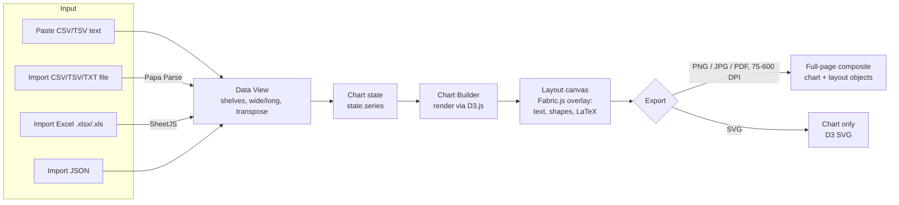
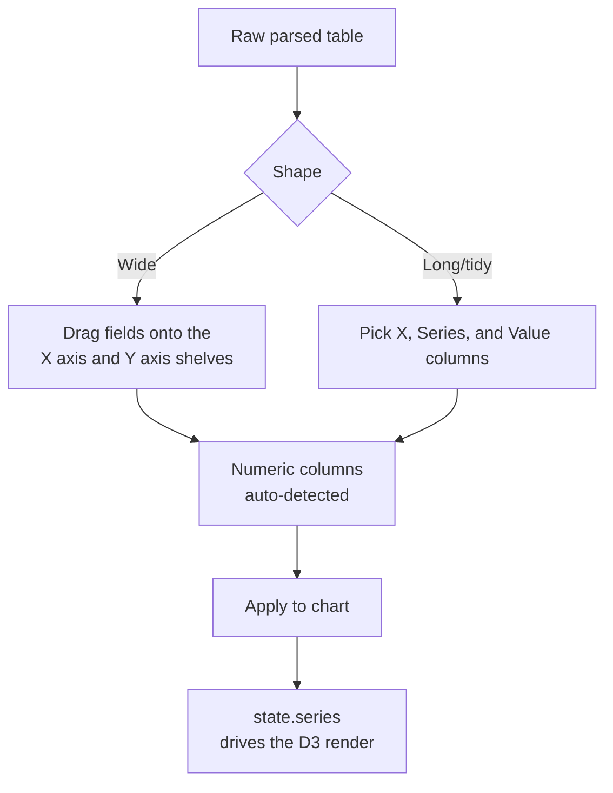
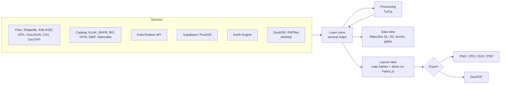

# GIS Consultant Studio

**A private studio for Defani's work on the Gayo coffee landscape**: field surveys, forest and deforestation checks, maps and print layouts, charts, and an agroforestry simulator, in one app. It runs in the browser (static files, no backend) and as a small Windows desktop app.


**Web app: [defani.github.io/Ploots-click](https://defani.github.io/Ploots-click/)** · **Windows installer: [Releases](https://github.com/Defani/Ploots-click/releases)**

## Table of Contents

- [What is this?](#what-is-this)
- [Opening the app](#opening-the-app)
- [Stack and engines](#stack-and-engines)
- [Inspired by](#inspired-by)
- [Desktop app](#desktop-app)
- [Features](#features)
  - [GIS: Data view and Layout view](#gis-data-view-and-layout-view)
  - [Forests, deforestation and Earth Engine](#forests-deforestation-and-earth-engine)
  - [Databases and big files](#databases-and-big-files)
  - [Agroforestry simulator](#agroforestry-simulator)
  - [Charts](#charts)
  - [Chart gallery](#chart-gallery)
  - [Data View](#data-view)
  - [Editor: toolbars, Design panel & layers](#editor-toolbars-design-panel--layers)
  - [Map workspace (GIS)](#map-workspace-gis)
  - [KoboToolbox monitoring](#kobotoolbox-monitoring)
  - [Files (folder browser)](#files-folder-browser)
  - [Plugins](#plugins)
  - [Page layout & annotation](#page-layout--annotation)
  - [Export](#export)
- [Design system](#design-system)
- [Architecture](#architecture)
- [Project structure](#project-structure)
- [LaTeX & Symbol Catalog](#latex--symbol-catalog)
- [Color Palettes — sources & licensing](#color-palettes--sources--licensing)
- [Fonts — sources & licensing](#fonts--sources--licensing)
- [Icons — sources & licensing](#icons--sources--licensing)
- [Page templates](#page-templates)
- [Fill patterns, dash styles & data-point markers](#fill-patterns-dash-styles--data-point-markers)
- [Layout shape library](#layout-shape-library)
- [Export details](#export-details)
- [Value label formatting](#value-label-formatting)
- [Error bars](#error-bars)
- [Keyboard shortcuts](#keyboard-shortcuts)
- [Libraries & versions](#libraries--versions)
- [Data sources](#data-sources)
- [References](#references)
- [Known limitations](#known-limitations)
- [Built with](#built-with)
- [License](#license)
- [Purpose & Acknowledgements](#purpose--acknowledgements)
- [Feedback & Contributions](#feedback--contributions)
- [Author](#author)

## What is this?

GIS Consultant Studio is Defani Arman Alfitriansyah's private working tool. It supports work on sustainable, **deforestation-free coffee** in the Gayo landscape (Aceh, Indonesia): the field surveys behind it, the forest and land-change checks that EUDR due diligence, Rainforest Alliance and sustainable forest management ask for, the maps and reports that come out of them, and the agroforestry systems the coffee grows in.

It has three modes, chosen on the Home screen:

| Mode | What it is for |
|---|---|
| **Chart** | Publication-ready charts from tables (25 chart types, one D3 engine), on a page with text, shapes and formulas |
| **Map** | A GIS: layers, symbology, processing, field data, forest data, Earth Engine, databases, and print layouts with GeoPDF export |
| **Agroforestry** | A SExI-FS-style simulator of Gayo coffee under shade trees, in 2D and realistic 3D |

Everything runs on your device. Data you open is read locally and never uploaded; the app only goes online for what you ask for (basemap tiles, catalogs, Kobo, Earth Engine, Global Forest Watch, Supabase).

[⬆️ Back to Table of Contents](#table-of-contents)

## Opening the app

There is **no account**. The app opens with:

1. a short **loading screen** with the animated logo,
2. Defani's **welcome as chat bubbles** (his photo, what the studio is for),
3. **Home**, with the three modes as cards. Each card plays a short animated preview of its own mode (the sample chart, the Hansen tree-cover-loss map, and the simulator's 3D coffee garden).

A click or any key skips straight to Home.

[⬆️ Back to Table of Contents](#table-of-contents)

## Stack and engines

Plain HTML, CSS and JavaScript loaded as numbered script files: no framework, no bundler, no build step for the web app. Heavy libraries load only when a feature first needs them (`js/lazy-loader.js`, and the agroforestry module loads only when it is opened).

| Area | Engine | Notes |
|---|---|---|
| Maps | **MapLibre GL JS 5.9** | vector and raster layers, 2D map, **3D terrain** (Mapzen / AWS Terrarium elevation), **3D globe** with atmosphere |
| Geoprocessing | **Turf.js 7.2** | buffer, clip, dissolve, intersect, union, hulls, conversions, interpolation, clustering, enumerator routes |
| Rasters | **geotiff.js 2.1** | GeoTIFF in EPSG:4326, 3857 and UTM, colour ramps or RGB |
| Vector formats | own readers (`js/formats.js`) | Shapefile with `.prj` reprojection, KML / KMZ, GPX, GeoJSON, TopoJSON, CSV with coordinates |
| SQL and big files | **DuckDB-WASM 1.32** (spatial, json, parquet extensions), **PMTiles 4.5** | GeoParquet and SQL in the desktop app; PMTiles archives as layers |
| Remote sensing | **Google Earth Engine JS API 1.7**, **maplibre-gl-earth-engine 0.4** (the control GeoLibre uses) | catalog, search, load, layers, inspector, code |
| Forest data | **Global Forest Watch** tiles and Data API | Hansen/UMD tree cover, loss and gain, alerts, primary forest, peat, mangroves… |
| Databases | **Supabase** (PostgREST) with **PostGIS** | read and write layers, RPC, viewport queries |
| Field data | **KoboToolbox API v2** | API token; monitoring dashboard, routes, quality checks |
| Charts | **D3.js 7.9** (bundled) | every chart type and the d3-geo maps |
| Page layout | **Fabric.js 5.3** | the page canvas for charts and print layouts |
| 3D plants | **Three.js r147** + OrbitControls | procedural, instanced, level of detail |
| Tables | **AG Grid Community 35**, **Papa Parse 5.4**, **SheetJS 0.18**, **math.js 12** | Data View, CSV and Excel import, formulas |
| Formulas | **MathJax 3** | LaTeX on the page |
| Export | **jsPDF 2.5**, **svg2pdf.js 2.2**, own GeoPDF writer | PNG, JPG, SVG, PDF and **GeoPDF** (ISO 32000 geospatial) |
| Desktop | **Tauri 2** (Rust, WebView2) | offline bundle, native Kobo requests, minified code |
| Offline web | Service worker (`sw.js`) | network-first cache, installable PWA |
| Icons and type | **Material Symbols Rounded** (weight 300), Inter / Poppins and more from Google Fonts, Iconify | glass design system in `css/glass.css` |

[⬆️ Back to Table of Contents](#table-of-contents)

## Inspired by

GIS Consultant Studio does not copy code from these projects (except where a library is used as is, listed under [Libraries & versions](#libraries--versions)); it follows how they work, so the tool feels familiar to people who use them.

| From | What it inspired here |
|---|---|
| **[QGIS](https://qgis.org)** | the layer tree, Layer Styling (single / categorized / graduated, colour-ramp button with previews), QGIS expression syntax for filters and the field calculator, the Processing Toolbox, the locator bar, the Browser panel (Files), digitizing, and the **Layout** window: Items / Item Properties / Layout tabs, a thin tool column, rulers you drag guides out of, coordinate grids with DMS labels outside the frame |
| **[ArcMap / ArcGIS Pro](https://www.esri.com/en-us/arcgis/products/arcgis-pro)** | the **Data view / Layout view** switch at the bottom left, the scale box in the top bar, the **Insert** menu, several **maps** in one project with **map frames** showing any of them, the layer right-click menu |
| **[GeoLibre](https://github.com/opengeos/GeoLibre)** (opengeos) | the Tauri desktop app and its offline build, the plugin system, the **Earth Engine** control and how it signs in (auth library loaded before the click, minimal scopes), the MapLibre **3D globe** with a slow spin, the data catalog, the KoboToolbox connector and the **geolibre-live** MCP bridge to Claude |
| **[SExI-FS](https://www.worldagroforestry.org/output/sexi-fs-spatially-explicit-individual-based-forest-simulator)** (ICRAF) | the agroforestry simulator: individual trees on a plot, species parameters (Chapman–Richards growth, allometries, crown porosity, light response), the SExI-FS tree and topography file formats, the **New stand** dialog, the **2D plot** (pink metre grid, paint modes Outline / Opaque / Transparent / Shaded, tree info) and the **virtual forest** in 3D (wire-mesh crowns over a maroon grid) |
| **[Global Forest Watch](https://www.globalforestwatch.org)** | the forest panel: Hansen tree cover loss by year, alerts, area statistics for an area of interest |
| **[Google Earth Engine Code Editor](https://code.earthengine.google.com)** | the code box with `Map.addLayer`, `Map.centerObject`, `print` and ready recipes |
| **[Avenza Maps](https://www.avenza.com) / Adobe GeoPDF** | GeoPDF export: a page you can open as a georeferenced map in the field |
| **Canva / Figma** | the floating format bars and the Design panel, kept for the **Chart** mode only (the GIS layout stays a GIS layout) |
| **[n8n.io](https://n8n.io)** and similar product pages | the idea of an opening with a personal welcome before the work |

[⬆️ Back to Table of Contents](#table-of-contents)

## Desktop app

GIS Consultant Studio also runs as a **desktop app for Windows**, built with [Tauri 2](https://tauri.app), as GeoLibre Desktop is. It uses the system's WebView2, so the installer stays around 30 MB.

- **Nothing is hosted.** The app's code, libraries (MapLibre GL, Turf, Fabric.js, AG Grid, MathJax, SheetJS, jsPDF, geotiff.js, Three.js, …), the DuckDB engine with its spatial, json and parquet extensions, fonts and icons are all inside the app, and the app's own code is minified. Files you open stay on your computer.
- **Online only when you ask.** Basemap tiles, the data catalog, Global Forest Watch, Earth Engine, Supabase and KoboToolbox connect only when you use them. The Earth Engine control is the one library that stays on the CDN, because it only works online anyway.
- **KoboToolbox without a proxy.** The app calls the Kobo API natively, so `tools/kobo_proxy.py` is not needed.
- **Earth Engine** in the desktop app uses an access token (`gcloud auth print-access-token`): Google does not accept its sign-in popup from an app window.
- Web links open in your default browser.

**Install:** download `GIS.Consultant.Studio_<version>_x64-setup.exe` (or the `.msi`) from the [Releases](https://github.com/Defani/Ploots-click/releases) page. The setup installs for the current user only, without administrator rights; if WebView2 is missing, the installer gets it.

**Build it yourself (Windows):**

1. Install [Rust](https://rustup.rs), the [Visual Studio Build Tools](https://visualstudio.microsoft.com/visual-cpp-build-tools/) with the "Desktop development with C++" workload, Python 3 (with `pip install rjsmin rcssmin` for minification), and the Tauri CLI (`cargo install tauri-cli --version "^2" --locked`, or `npm install -g @tauri-apps/cli@^2` with Node.js).
2. Build the offline copy of the web app into `desktop/dist`. Downloads are cached in `desktop/.cache`:
   ```bash
   python desktop/build_dist.py
   ```
3. Build the installers from the `desktop` folder with `cargo tauri build` (or `tauri build` with the npm CLI). They land in `desktop/src-tauri/target/release/bundle/nsis/` and `…/msi/`.

The workflow `.github/workflows/desktop.yml` runs the same steps on every push that changes the app (a newer push cancels the build before it). Pushing a `desktop-v*` tag publishes a release with the installers.

[⬆️ Back to Table of Contents](#table-of-contents)

## Features

### GIS: Data view and Layout view

The Map mode has two views, switched with the two small buttons at the **bottom left**, as in ArcMap:

**Data view** (the map itself)
- **Top bar**: icons only (their names show in a quick tooltip): add layer, basemap gallery, attribute table, tools, draw (digitizing), geoprocessing, a **scale box** (`1:…`, type a scale or pick one) and the map tools (pan, select, identify, measure, zoom, extents, **3D terrain**, **3D globe**).
- **Left rail**: add vector / raster / XYZ / URL / sample layers, Files, the Processing Toolbox, map animation, the data catalog, **GFW**, **GEE**, **PostGIS** (Supabase), **Kobo** and plugins. Panels are flat property sheets without hint text.
- **Right dock**: **Layers** and **Layer styling** as two tabs.
- **Status bar**: coordinates, scale, zoom, rotation, CRS, layer count.
- **Several maps** in one project, each with its own layers, basemap and view.

**Layout view** (the print layout, like QGIS's Layout window)
- **Left**: a thin tool column (select, move map content, zoom in / out / 100% / whole page, then the items to insert).
- **Top bar**: the **Insert** menu (a map frame of any map or a new map, title, text, credits, legend, scale bar, scale text, north arrow, inset map, colour bar, rectangle, ellipse, line, arrow, picture) and the layout tools (templates, page, align, distribute, arrange, group, lock).
- **Right dock**: **Items**, **Item Properties** (the Map frame's view, grid and frame for a map; text, font, size in pt, colour, halo, alignment for text; fill and outline for shapes; the inset's basemap, which starts on OpenTopoMap) and **Layout** (paper, orientation and **Export**).
- Nothing opens by itself when an item is clicked, and there are no floating bars in this view.
- **Rulers**: drag from a ruler to pull out a guide (Alt+drag pans); the mouse wheel zooms.
- **Grid**: geographic (D° M′, D° M′ S″ always, or decimal degrees) or UTM, labels inside or outside the frame.
- **One Export button** (round, top right): PNG, JPG, SVG, PDF and **GeoPDF**. While it exports, a small card waits until every map tile has loaded; raster basemaps and tile layers are fetched one or two zoom levels deeper so they are as sharp as the vector layers at 300 dpi.
- **Templates**, including **Peta tematik (KLHK / BIG style, A4 portrait)**: a boxed title, the map with a D° M′ S″ grid outside the frame, a locator inset (with its own grid) and north arrow, the scale bar, and a band of boxes for KETERANGAN (legend), information, datum and projection, Sumber and Dibuat.
- **Zoom the map to the active layer** or to all layers from the tool column, besides setting the scale.
- **Legend** lists tile layers too: GFW tree cover loss as its year ramp, tree cover density, gain, alerts, GBIF density, and a plain swatch for other tiles.

**Projects (.gcsproj)**, like a QGIS .qgz: Save (Ctrl+S), Save as and Open (Ctrl+O) in the top bar, **Home › Map › Open project**, or double-click a .gcsproj in Files. One file keeps every map with its layers (vector data, raster bands, tile URLs), symbology, labels, basemaps and views, the page size and every layout item, and the chart and Data View, so a layout is opened again instead of rebuilt.

**Processing Toolbox** (Turf.js): vector geoprocessing (buffer, clip, difference, intersection, union, dissolve, convex and concave hulls, variable buffer), geometry (centroids, point on surface, bounding boxes, simplify, smooth, polygons ↔ lines), analysis (count points in polygon, distance to nearest hub, …), creation, selection, conversion, interpolation, clustering, general tools, and **Field data → Enumerator routes**: each enumerator's points joined in the order they were collected (per day if chosen) with the number of interviews, distance and hours.

### Forests, deforestation and Earth Engine

- **Global Forest Watch** (left rail, GFW): Hansen/UMD **tree cover loss** for chosen years and canopy density (decoded per pixel, so only the chosen years show), **tree cover density 2000**, **tree cover gain** (`umd_tree_cover_gain_from_height`), primary forests, integrated deforestation alerts (GLAD-L, GLAD-S2, RADD), VIIRS fires, mangroves, peatlands, intact forest landscapes, protected areas, Indonesia's forest moratorium and oil palm concessions. **Analysis**: loss and emissions by year, primary forest loss, tree cover in 2000 and a no-key estimate of loss by year from the tiles, for the map view or a polygon layer.
- **Google Earth Engine** (left rail, GEE): the **maplibre-gl-earth-engine** control GeoLibre uses, inside the sidebar: **Browse/Catalog** (all 5,000+ datasets), **Search**, **Load** (with visualization parameters), **Layers** (opacity, visibility), **Inspector** (pixel values) and **Code**. The project defaults to `ee-defaniarman`. Sign-in follows GeoLibre: the auth library is loaded when the panel opens so Google's popup is not blocked, with only the `earthengine` and `drive.file` scopes; errors say what to fix (authorized JavaScript origin, test user, Earth Engine API). Recipes (Sentinel-2, Landsat, NDVI, …) and a code box run with `Map.addLayer`, `Map.centerObject` and `print`.
- **MapBiomas Alerta** (Indonesia) as a WMS layer; MapBiomas land cover needs an Earth Engine sign-in.
- **Data catalog**: Kementerian Kehutanan (KLHK), BNPB, BIG / Ina-Geoportal and any ArcGIS REST server; all Global Forest Watch datasets; **GBIF** and **iNaturalist** species records; each with its provider's logo.
- **Kawasan hutan** can be styled in the KLHK colours (HL, KSA/KPA, HP, HPT, HPK).

### Databases and big files

- **Supabase / PostGIS** (left rail): connect with the project URL and key, list tables and views, detect PostGIS geometry columns, load layers (optionally only what is in view, via an RPC helper), call functions, and upload layers back (EWKT).
- **Desktop engines** (desktop app): **DuckDB** with the spatial, json and parquet extensions for SQL over CSV, Parquet and **GeoParquet**, and **PMTiles** archives as layers, all offline.

### Agroforestry simulator

The third mode: Gayo coffee under shade trees, in the spirit of ICRAF's **SExI-FS**. It loads only when opened.

- **New stand** dialog first (File › New stand, Ctrl+N): name, width and length, slope and the side it faces (written as SExI-FS topography), the garden floor, and what to plant. The default is an **example of 40 plants** at the densities reported for Gayo coffee agroforestry by Pramulya et al. (2026): 32 coffee at 2.7 m (≈1,370/ha; paper: 1,359 ± 502) and 8 lamtoro at 5.4 m (≈340/ha; paper: overstory 394 ± 340), grown five years.
- **Menu bar** File · Stand · Simulation · View.
- **Model**: Chapman–Richards diameter growth, height and crown allometries, crown porosity and the species' light response; the light a crown gets is the product of the transmission of the crowns above it; managed pruning keeps coffee at about 1.8 m and lamtoro in the 2–9 m overstory; long suppression kills a tree. Outputs: trees per ha, mean DBH and height, canopy cover, shade at the coffee layer, an indicative green-bean yield, above-ground biomass and carbon (Chave et al. 2005), charts over the years, CSV.
- **Species**: Arabica coffee (Gayo), lamtoro (*Leucaena leucocephala*), avocado, orange, petai, **jackfruit** (*Artocarpus heterophyllus*) and **pine** (*Pinus merkusii*), all editable.
- **Data**: SExI-FS tree files (`iid x y spesies dbh height cr_depth cr_curve cr_radius rot cp cf`) and topography (`X Y Altitude`) in and out; projects as JSON.
- **2D** exactly in the SExI-FS look: white sheet, fine pink metre grid, crowns as plain circles (or the SExI-FS crown radii), paint modes **Outline / Opaque / Transparent / Shaded**, **Show info** labels that avoid overlapping, and an optional light map.
- **3D Realistic** (default): procedural, instanced plants modelled on field photos from Gayo: Arabica as a beehive bush with glossy opposite leaves folded along the midrib and cherry clusters in the axils; lamtoro with one straight trunk forking into a rounded umbrella crown of bipinnate foliage, flat reddish pods and pom-pom flowers; avocado with leaf rosettes and pear fruit; jackfruit with big knobbly fruit on the trunk; pine with whorled branches. **Garden floor**: grass, bare soil, leaf litter, or soil under the rows with grass alleys. Sun position for Takengon by hour, flowering, eye-level and whole-plot cameras, level of detail and on-demand rendering so it stays smooth on a laptop GPU.
- **3D SExI-FS**: the virtual forest as SExI-FS draws it, wire-mesh crowns without texture in bright per-species colours over a maroon grid, seen from above.
- **3D navigation panel**: move, rotate, tilt, zoom, Top / Front / Side / 3D views; keys W A S D, Q E, R F, + −.

[⬆️ Back to Table of Contents](#table-of-contents)

### Charts

The Chart mode is a page editor: the chart block sits on a full page with text, shapes and formulas around it.

<p align="center">
  
</p>

Everything is set from **one sidebar on the left**, so the page keeps the rest of the window. Its rail is grouped by task (**Home** · **Data** · **Canvas**, **Design**, **Layers** · **Chart**, **Axis**, **Legend**, **Style** · **Shapes**, **LaTeX** · **Export**), and each mode only shows the menus it uses. The page canvas has rulers, the mouse wheel zooms, and a dark theme is one click away (moon icon):

<p align="center">
  
</p>

- **25 chart types, all drawn by one D3.js engine** (`js/d3-engine/`), so axes, ticks, legends, titles, patterns and export behave the same on every chart:

  | Group | Chart types |
  |---|---|
  | Bar | single bar, grouped bar, stacked bar (incl. 100%), lollipop, dumbbell / slope |
  | Line & Area | line, area, scatter, bubble |
  | Circular | pie, donut, radial rings (multi-track), sunburst |
  | Distribution | histogram, box plot, violin plot, ridge plot |
  | Other | heatmap, waterfall, funnel, treemap, sankey, scatter matrix |
  | Map | choropleth map, bubble map |

- **Maps** (choropleth and bubble map) are drawn with d3-geo from Natural Earth base maps served locally from `vendor/topojson/`, so they work offline. Choropleth takes ISO-3 codes or country names, a continuous or classed colour scale, several scopes (world, continents, USA) and projections, a fixed value range for comparing maps, or your own **custom GeoJSON** (e.g. Indonesian provinces).
- **Radial rings (multi-track)**: circular category plot in the style of multi-genome COG/functional-category figures. Categories become angular sectors (width ∝ average share), each series a concentric track, with outside labels that are spread apart and joined to their sector by leader lines.
- **Sunburst**: slash-delimited paths (`Vegetasi/Mangrove/Rapat`) become a hierarchy; click a segment to zoom in, click the centre to zoom back out.
- **Sankey**: rows written as `Source -> Target` become flows between nodes, with links drawn as filled ribbons.
- **Format Axis**: click an axis on the chart to open a per-axis panel: range (auto or fixed), logarithmic scale, major/minor tick spacing, tick marks and their position, number format, line width and colour.
- **Data input**: paste tab- or comma-separated data, or import **CSV/TSV/TXT** (Papa Parse, so quoted fields and embedded commas are handled), **Excel** `.xlsx`/`.xls` (SheetJS, multi-sheet), or **JSON** (array of objects or 2D array).
- **Per-series controls**: visibility, colour, label, fill pattern, marker shape, and a **secondary Y-axis** (bar/line/area/scatter).
- **Visual style modes**: Color, Color + Pattern, or Pattern (grayscale), backed by 8 hatch/fill patterns, so figures stay readable in print or black-and-white.
- **106 built-in colour palettes**, see [Color Palettes](#color-palettes--sources--licensing).
- **Typography**: 5 fonts (Cambria, Times New Roman, Arial, Poppins, Cambria Math) with separate controls for the title/subtitle and for the chart body, axes and legend.
- **Legend**: show/hide, 7 position presets, 1 to 4 columns, title, font size, border, drag it anywhere on the chart, or **detach** it into a free object on the page (pie, donut, funnel and treemap legends list their categories).
- **Value labels** with formatting (auto, integer, 1 or 2 decimals, thousands separator, percent, currency), **error bars** (percent or fixed), bar gap/width controls, outline and frame toggles.

### Chart gallery

Every chart type, rendered by the D3 engine from its built-in sample data (click an image to open it full size):

<table>
  <tr>
    <td align="center"><br><sub>Bar – single</sub></td>
    <td align="center"><br><sub>Bar – grouped</sub></td>
    <td align="center"><br><sub>Bar – stacked</sub></td>
  </tr>
  <tr>
    <td align="center"><br><sub>Lollipop</sub></td>
    <td align="center"><br><sub>Dumbbell / slope</sub></td>
    <td align="center"><br><sub>Line</sub></td>
  </tr>
  <tr>
    <td align="center"><br><sub>Area</sub></td>
    <td align="center"><br><sub>Scatter</sub></td>
    <td align="center"><br><sub>Bubble</sub></td>
  </tr>
  <tr>
    <td align="center"><br><sub>Pie</sub></td>
    <td align="center"><br><sub>Donut</sub></td>
    <td align="center"><br><sub>Radial rings</sub></td>
  </tr>
  <tr>
    <td align="center"><br><sub>Sunburst</sub></td>
    <td align="center"><br><sub>Histogram</sub></td>
    <td align="center"><br><sub>Box plot</sub></td>
  </tr>
  <tr>
    <td align="center"><br><sub>Violin plot</sub></td>
    <td align="center"><br><sub>Ridge plot</sub></td>
    <td align="center"><br><sub>Heatmap</sub></td>
  </tr>
  <tr>
    <td align="center"><br><sub>Waterfall</sub></td>
    <td align="center"><br><sub>Funnel</sub></td>
    <td align="center"><br><sub>Treemap</sub></td>
  </tr>
  <tr>
    <td align="center"><br><sub>Sankey</sub></td>
    <td align="center"><br><sub>Scatter matrix</sub></td>
    <td align="center"><br><sub>Choropleth map</sub></td>
  </tr>
  <tr>
    <td align="center"><br><sub>Bubble map</sub></td>
    <td></td>
    <td></td>
  </tr>
</table>

<p align="center">
  
  <br><sub>Map settings: base map (world or custom GeoJSON), scope, projection, continuous or classed colour, value range.</sub>
</p>

### Data View

<p align="center">
  
</p>

- A spreadsheet-style table (AG Grid), separate from the applied chart data: edit cells, rename columns, add rows/columns, paste from Excel or Sheets, sort and search.
- **Chart mapping shelves**: drag fields onto the X and Y axes to decide what the chart plots; fields left off both shelves are listed as unused.
- **Wide ↔ long/tidy** reshaping, **transpose**, spreadsheet **formulas** (`=SUM(A1:A5)`, `=AVERAGE(...)`, cell references) and per-column **Statistics**, with a Σ summary row.
- **Revert** discards the edits; **Apply to chart** sends the table to the chart.

### Editor: toolbars, Design panel & layers

**Canva-style floating toolbar.** Selecting text shows its format bar above the canvas (font, size, colour, bold/italic/underline/strike, case, alignment, lists, super/subscript, line spacing, opacity, effects, position), plus a small action bar next to the object (duplicate, lock, delete, more):

<p align="center">
  
</p>

**Shapes and other objects** get the same kind of floating bar (fill, stroke, dash, opacity, position). A Figma-style **size badge** (`W × H`) sits under the selection, with dashed **distance guides** to the page's left and top edges. The **Design** panel edits position, alignment to the page, rotation and flips, size (with a proportion lock), opacity, corner radius, fill, stroke and drop shadow:

<p align="center">
  
</p>

**Advanced colour picker** with **solid or gradient** fills (linear/radial, angle, draggable colour stops), HSV area, hue and alpha sliders, Hex/RGB/HSL input, an eyedropper, saved swatches and the colours already used on the page:

<p align="center">
  
</p>

**Layers** lists every object on the page (with thumbnails, type and font details): drag to reorder, rename, hide, lock, and group/ungroup. The chart itself always stays at the back:

<p align="center">
  
</p>

**Sidebar panels** for the axes, style and legend:

<table>
  <tr>
    <td align="center"><br><sub>Axis</sub></td>
    <td align="center"><br><sub>Color &amp; style</sub></td>
  </tr>
  <tr>
    <td align="center"><br><sub>Legend</sub></td>
    <td align="center"><br><sub>Export</sub></td>
  </tr>
</table>

### Map workspace (GIS)

The reference for the map tools that both views share. Layers, symbology and the tools below work the same in Data view and in the map frames of Layout view:

<p align="center">
  
</p>

- **Layers**: any number of **vector** layers (GeoJSON, TopoJSON, **Shapefile**, **KML / KMZ** or **GPX** from a file, a zipped shapefile, a URL or pasted text), **raster** layers (**GeoTIFF**: EPSG:4326, EPSG:3857 and WGS 84 / UTM zones; single-band on a color ramp, continuous or in discrete classes, or RGB) and **XYZ tile** layers. The layer list works like the QGIS layer tree: drag to reorder, hide, expand a layer to see its classes, and optional feature counts.
- **Layer menu** (right-click a layer or its ⋮ button), as in QGIS and ArcGIS: zoom to layer or selection, open the attribute table, layer styling, **filter** (definition query), **select by expression**, select all / invert / clear, **field calculator**, show in legend, show feature count, show labels, rename, duplicate, move to top or bottom, export GeoJSON / selected features / CSV / **Shapefile (.zip)** / **KML** (keeps single and categorized colors) / **GPX**, properties and remove. Double-click a layer for its **properties**: name, legend name, attribution, source information (features, geometry, fields, CRS, extent), opacity and **scale-dependent visibility** (minimum and maximum 1:n).
- **Expressions** (filter, select by expression, field calculator) use QGIS syntax, e.g. `"population" > 50 AND "subregion" = 'Maritime'`, `name LIKE 'Ma%'`, `iso3 IN ('IDN', 'MYS')`, `"area" IS NOT NULL`, `"pop" / "area" * 1000`, with a field list, a value list and a live count of matching features.
- **Symbology** per layer, as in QGIS: **Single symbol**, **Categorized** (a color per value, each editable) and **Graduated** (natural breaks / Jenks, quantile or equal interval on a color ramp). Values come from a feature property or are **joined from the Data table**. Fill opacity, stroke, point size and line width, and solid, dashed, dotted or dash-dot outlines and lines. Vector tile layers get fill, outline, opacity, line width and style, and point size.
- **Renderers**: plain features, **proportional symbols** (circle area or linear size by a numeric field, also at polygon centroids, with nested reference circles in the legend) or a **heatmap** (optional weight field, radius, intensity, color ramp).
- **Labels**: a field or a **template** such as `{name} ({population_m} M)`, regular/bold/italic font, color, **halo** color and width, labels that **follow lines** (rivers, roads), and an option to show all labels even when they overlap.
- **Basemaps** (35, grouped): OpenFreeMap vector styles; imagery (Esri World Imagery, Sentinel-2 cloudless 2023/2024 by EOX, NASA VIIRS true color of the latest day, NASA Blue Marble); topographic (Esri Topo, Terrain, Shaded Relief, Physical, National Geographic, Ocean, OpenTopoMap); streets (OpenStreetMap, OSM Humanitarian, CyclOSM, CARTO Voyager, Esri Streets); light and dark canvases (CARTO, Esri); seven **GBIF** styles; or none.
- **Data catalog** (Catalog in the rail, or Add layer → Data catalog), read live so the newest releases appear as soon as they are published:
  - **Government** ArcGIS servers: **Kementerian Kehutanan** (Planologi, formerly KLHK: forest areas, deforestation, burned areas…), **BNPB** (disaster data, including the current year) and **BIG / Ina-Geoportal** (RBI), plus any other ArcGIS REST server by URL. Browse folders and services, sort newest first, and add layers as map tiles or as features (with the attribute table and symbology).
  - **Global Forest Watch**: all 380+ datasets, searchable, each added at its latest version (raster datasets as tiles, vector datasets as vector tiles).
  - **Species**: **GBIF** occurrences and **iNaturalist** observations for a taxon (autocomplete, accepted names first) in the map view, a country or worldwide, with year range, record type or quality grade and a record limit; the fields useful for analysis are kept (dates, observer, accuracy, license, links). GBIF can also add its occurrence **density map**.
- **Map view**: set the **scale (1:n)** and **rotation** directly, **lock** the map, or **move the content** inside the frame (double-click the map) with **Pan**, **Select** (click or drag a box), **Identify** and **Measure** (line length, or area and perimeter, on the sphere) tools, zoom in / out / full / to layer / to selection, and previous and next extent. The same tools are in the top bar's **Tools** menu. The mouse wheel zooms the map while moving content.
- **Coordinate grid**: geographic (degrees-minutes or decimal degrees) or **UTM** in meters or kilometers (zone from the map center or chosen), as lines or crosses, with labels **inside or outside the frame** (outside labels get their own margin and ticks, as in a QGIS map item), and a configurable map **frame**.
- **Layout items**, free objects on the page that stay **linked to the map**: a **legend** built from the symbology (choose which layers and which classes it lists, whether hidden layers appear, and a legend name per layer), a **scale bar** (single box, double box, line ticks middle/down/up, stepped, hollow or numeric 1:n; units, segments, background frame), a **north arrow** (eight styles, follows the map rotation), an **inset map** that shows the main map's extent, and a matplotlib-style **color bar** for a raster or graduated layer (continuous or discrete, square or pointed ends on both, min or max, horizontal or vertical, ticks and title). Move, resize and layer them like any shape; text, LaTeX and shapes from the usual tools sit alongside.

<p align="center">
  
</p>

- **Attribute table** (a dock under the map): view and **edit** values, **select** features (rows and map stay in sync, selections shown in yellow), show selected only, search, **select by expression**, add a field, the **field calculator**, delete features, and **export GeoJSON, CSV, Shapefile (.zip), KML or GPX** of all features or only the selected ones.

<p align="center">
  
</p>

### KoboToolbox monitoring

The **Kobo** button in the rail (map mode) connects to a KoboToolbox server (Global, EU, OCHA or your own) with your API token and lists your forms. Pick a form and open the **monitoring dashboard**:

- **Overview**: submissions, today versus yesterday, enumerators active today, average per enumerator-day, area surveyed, quality flags and the last submission; a chart of submissions per day stacked by enumerator; an **enumerator × day matrix** that shows who submitted how much on each day, with today highlighted; today's status per enumerator (active in the last hour, idle, or no submission yet); and a live feed where new submissions are highlighted.
- **Enumerators**: submissions, today, active days, per day, median interview length, GPS coverage and median accuracy, distance walked, area, quality flags and last submission, plus the list of flagged submissions.
- **Recap**: every question, with choice counts for select questions and statistics plus a histogram for numbers, and a per-village table.
- **Route**: an animated route per enumerator for one day, on its own map. Play or pause, choose the speed, scrub the timeline, turn enumerators on and off, and watch a bubble pop up at each arrival. While the dashboard refreshes, new submissions animate in.
- **Data**: the submissions table with search, CSV export and **Add to map**. Add to map creates a point layer colored by enumerator, with every answer as an attribute, ready for symbology, labels, the attribute table and the print layout. Routes can be added as a line layer too.

Filters for date range and enumerator apply to every tab. **Auto refresh** (every 1 to 30 minutes) fetches only new submissions and shows a notification with who sent them. Fields for enumerator, respondent, village, area, survey date and location are detected from common names and can be changed. Quality checks flag short interviews, missing GPS and poor GPS accuracy.

**Why a proxy is needed (web app only).** The KoboToolbox API does not allow requests from other websites (CORS), so a browser page cannot read it directly. Run the small proxy in `tools/` on your computer; it only forwards read-only `/api/v2/` requests to Kobo servers, listens on `127.0.0.1` only, and never stores your token:

```bash
python tools/kobo_proxy.py
```

Add `--allow-host kobo.example.org` for a self-hosted server. Add `--demo` to also serve a generated demo form, "Coffee farmer baseline (demo)": five enumerators near Takengon over the last ten days, with today's submissions arriving through the day. The demo lets you try the dashboard without an account.

#### Chat with Claude

The round **Claude** button opens a chat bubble. It connects GIS Consultant Studio to the **geolibre-live** MCP server (the same server used by the GeoLibre Live MCP Bridge plugin) at `ws://127.0.0.1:9878`. With that server registered in Claude Desktop or Claude Code:

- Messages typed in the bubble reach Claude through `live_chat_wait` / `live_chat_inbox` (say "dengar geolibre" in Claude to start listening). Claude answers in the bubble with `live_say` (a task list with progress, then a notification when done) and `live_show_chart` (Plotly charts inside the chat).
- Claude reads the survey from the real submissions with `live_kobo_summary`, `live_kobo_fields`, `live_kobo_rows`, `live_kobo_aggregate` and `live_kobo_load`. It gets the same derived fields as the GeoLibre Kobo Connector (`_enumerator`, `_desa`, `_tanggal`, `_submission_date`, `_luas_ha`, `_validasi`), plus `_durasi_menit`.
- Claude can also read and drive the map: `live_get_state`, `live_list_layers`, `live_get_layer_features`, `live_get_selection`, `live_screenshot`, `live_set_view`, `live_zoom_to_layer`, `live_set_basemap`, `live_add_geojson_layer`, `live_add_tile_layer`.

The server keeps one app connection and the newest one wins, so a GeoLibre window with the bridge plugin and GIS Consultant Studio take turns. If another app takes over, the bubble shows it and does not reconnect by itself. Connecting by hand turns on auto-connect for your next visit.

### Files (folder browser)

Like the QGIS Browser panel: **Files** in the left rail connects one or more folders on your computer. They are remembered for the next session; the browser or the desktop app asks again for permission when needed. Browse them as a tree and filter by name, then double-click (or press Enter on) a file to open it:

- **CSV / TSV / TXT, Excel, JSON tables** become chart data.
- A **CSV with latitude / longitude columns**, opened in the map workspace, becomes a point layer. This works for Kobo or GPS exports, for example.
- **GeoJSON / TopoJSON** become vector layers and **GeoTIFF** becomes a raster layer.
- **Shapefiles** open as layers. Only the `.shp` is listed, as in QGIS; its `.dbf`, `.prj` and `.cpg` are read with it. Coordinates are converted from UTM, any Transverse Mercator (e.g. DGN95 / Indonesia TM-3) or Web Mercator to WGS 84, and polygon holes are kept.
- **KML / KMZ** (Google Earth, Avenza, Kobo exports) open as layers, with names, descriptions, ExtendedData and folders as attributes.
- **GPX** opens as waypoints, one line per track segment (with its length and start / end time) and routes.
- A **zipped shapefile / KML / GPX** is added to the map.
- **Images** are placed on the page.
- A **plugin .zip** is installed.

**Working with files:**

- **Type filter:** All, Tables, Vector, Raster or Images.
- **Several at once:** Ctrl / Shift + click to select several files, then **Open all**.
- **Right-click** for Open, Use as chart data, Add as points (tables with latitude / longitude), Add to map, Copy name and Copy path.
- **Drag** files onto the page or the map to open them; images land where they are dropped.
- **Watches** expanded folders while the app is visible. New files (a fresh Kobo export, GPS tracks just copied in) get a green dot and a notification.
- **Recent** lists the last files opened, above the folders.
- **Save exports to** a connected folder, or **Ask each time**, instead of Downloads. This covers every export: PNG / JPG / PDF / SVG, CSV and GeoJSON, Kobo CSV and plugin zips. Name clashes get " (2)", and the folder asks once for write access.

Selecting a file shows a **preview** before it is opened: the first rows of a CSV or Excel sheet (with the list of sheets), a thumbnail map of a vector file with its feature count, geometry type and fields, an image thumbnail, or a plugin's name and description. Expanded folders are remembered.

Files are read from disk when opened; nothing is copied or uploaded. This uses the File System Access API (Chrome, Edge and the desktop app). In other browsers, a folder can be read for the current session only.

### Plugins

Add features without changing the app, the same way as GeoLibre plugins. **Plugins** in the left rail installs a plugin from a `.zip`, a folder or a `plugin.json` URL (a `.zip` can also be dropped on the panel). Each installed plugin can be enabled, disabled, reloaded, downloaded as a `.zip` or removed. Installed plugins are kept in the browser (or the desktop app) and load at startup.

A plugin is a folder with a `plugin.json` manifest and one ES module that exports `activate(app)` / `deactivate(app)`. Through `app`, a plugin can:

- add top-bar buttons, rail panels, dialogs and notifications;
- read and change map layers, the view and the basemap;
- read and set chart data and the chart type;
- add text and images to the page;
- keep its own settings;
- read the KoboToolbox data;
- send messages to the Claude chat.

Everything a plugin adds is removed when it is disabled. **New plugin** downloads a working starter to edit. The API is documented in [PLUGINS.md](./PLUGINS.md), and an example plugin is in `plugins/examples/map-coordinates/` (cursor coordinates in decimal degrees, DMS or UTM).

### Page layout & annotation
- **Full-page canvas**, separate from the chart block: position and resize the chart anywhere on the page.
- **10 built-in page templates** (A4/Letter/Legal landscape & portrait, 16:9 and 4:3 presentation, Instagram Story, social square) plus custom width/height in px, mm or cm, and a page background colour.
- **Zoom** with the mouse wheel (around the pointer), the slider at the bottom right, or Ctrl + and Ctrl − (Ctrl 0 for 100%). Shift + wheel pans sideways; custom **pan scrollbars**.
- **Drafting-style rulers** on the canvas edges, unit- and zoom-aware, that also act as a source for **draggable guide lines**.
- **Layout objects** on top of the chart (Fabric.js): text boxes, 30 shapes, images and a vector **Pen tool** (click for corners, drag for curves, click the first point to close), with lock, duplicate, delete, grouping and a right-click menu.
- **LaTeX & symbol tool**: type formulas in `$...$` and see them rendered live on the canvas with MathJax (e.g. `$R^2 = 0.95$`, `$CO_2$`), with colour, size and font controls, recent formulas, ready-made templates, and a searchable symbol/unit catalog that also works in axis labels.
- **Undo/redo** for chart settings and canvas objects alike, and a **help search** (question-mark icon) that finds any menu or setting by name.


### Export
- **One Export button** (round, top right). In the Chart mode it opens the Export panel; in Layout view it opens Layout › Export.
- **PNG, JPG, SVG, PDF** and, for map layouts, **GeoPDF**, at **75, 100, 300 or 600 DPI**.
- PNG/JPG/PDF are a **full-page composite** of the background, the chart or maps and every layout object, exactly as shown in the editor. PDF can be **vector** (via svg2pdf) or flattened.
- **GeoPDF**: the flattened PDF plus an ISO 32000 geospatial measure dictionary (`/VP` viewport with `/Measure /GEO`, WGS 84 `/GPTS` and `/LPTS`) on the map frame, added as an incremental update. Avenza Maps, Adobe Acrobat and QGIS (GDAL) read it as a georeferenced map, so it can be used offline in the field.
- Layer styles also export as **SLD** (OGC Styled Layer Descriptor 1.1), which QGIS, GeoServer and ArcGIS Pro can load.
- Background: follow the canvas colour, force white, or transparent (PNG).

[⬆️ Back to Table of Contents](#table-of-contents)

## Design system

- **Glass look** (`css/glass.css`): soft translucent panels on a calm background, light and dark themes, the green palette of the logo (`#4e8a2e` / `#7cbf4a`).
- **Logo** (`assets/logo.svg`): round and flat, a green circle with a contour map sheet (GIS), a dashed data layer (data) and a location pin holding a coffee bean (coffee).
- **Icons only** in the top bar and tool columns, with quick tooltips (`js/tooltip.js`) instead of labels; panels are property sheets without hint text, and outlined buttons instead of solid green blocks.
- **GIS stays GIS**: in Layout view nothing floats over the page; Canva-style floating bars belong to the Chart mode only.

## Architecture

Everything happens on the device: no backend and no build step for the web app. The network is used only for libraries on first use (bundled in the desktop app), map tiles and the online services you connect.

**Chart mode**, from raw input to exported file:


```mermaid
flowchart LR
    subgraph Input
        A1[Paste CSV/TSV text]
        A2[Import CSV/TSV/TXT file]
        A3[Import Excel .xlsx/.xls]
        A4[Import JSON]
    end

    A1 --> B
    A2 -- Papa Parse --> B
    A3 -- SheetJS --> B
    A4 --> B

    B[Data View<br/>shelves, wide/long, transpose] --> C[Chart state<br/>state.series]
    C --> D[Chart Builder<br/>render via D3.js]
    D --> E[Layout canvas<br/>Fabric.js overlay:<br/>text, shapes, LaTeX]
    E --> F{Export}
    F -- PNG / JPG / PDF, 75-600 DPI --> G1[Full-page composite<br/>chart + layout objects]
    F -- SVG --> G2[Chart only<br/>D3 SVG]
```

> GitHub renders Mermaid with raw HTML/`` stripped from node labels, so logos can't sit *inside* the boxes above — this legend maps each engine to its stage instead:

| Stage | Engine |
|---|---|
| CSV/TSV parsing |  |
| Excel import |  |
| Chart rendering |  |
| Layout canvas / shapes / text |  |
| LaTeX formulas on canvas |  |

**Data View: wide ↔ long/tidy and field mapping**, the step between raw parsed rows and the chart's series:


```mermaid
flowchart TD
    Raw[Raw parsed table] --> Shape{Shape}
    Shape -- Wide --> Wide[Drag fields onto the<br/>X axis and Y axis shelves]
    Shape -- Long/tidy --> Long[Pick X, Series, and Value columns]
    Wide --> Detect[Numeric columns<br/>auto-detected]
    Long --> Detect
    Detect --> Apply[Apply to chart]
    Apply --> Series[state.series<br/>drives the D3 render]
```


**Map mode**, from data to a printed or geo-referenced map:


```mermaid
flowchart LR
    subgraph Sources
        S1[Files: Shapefile, KML/KMZ,<br/>GPX, GeoJSON, CSV, GeoTIFF]
        S2[Catalog: KLHK, BNPB, BIG,<br/>GFW, GBIF, iNaturalist]
        S3[KoboToolbox API]
        S4[Supabase / PostGIS]
        S5[Earth Engine]
        S6[DuckDB / PMTiles<br/>desktop]
    end
    Sources --> L[Layer store<br/>several maps]
    L --> P[Processing<br/>Turf.js]
    P --> L
    L --> M[Data view<br/>MapLibre GL: 2D, terrain, globe]
    L --> F[Layout view<br/>map frames + items on Fabric.js]
    F --> X{Export}
    X --> X1[PNG / JPG / SVG / PDF]
    X --> X2[GeoPDF]
```

**Agroforestry mode**: a stand (trees with position, species, size) grows year by year (growth, crowns, light, pruning, mortality); the same stand is drawn in 2D (canvas), 3D SExI-FS (Three.js wire mesh) and 3D Realistic (Three.js instanced procedural plants), and saved as SExI-FS files, JSON or CSV.

[⬆️ Back to Table of Contents](#table-of-contents)

## Project structure

```
.
├── index.html                     # App shell, styling, <script>/<link> tags
├── sw.js                          # Service worker (network-first cache, so the app also opens offline)
├── manifest.json                  # Web app manifest (installable PWA)
├── css/
│   ├── glass.css                  # The design system: glass panels, themes, top bar, docks, Layout view frame
│   ├── home.css                   # Home screen and its three cards
│   ├── splash.css                 # Loading logo and welcome bubbles
│   └── agro.css                   # Agroforestry simulator (menu bar, dialogs, 3D navigation)
├── js/
│   ├── splash.js                  # Loading screen with the animated logo, then Defani's welcome bubbles
│   ├── intro.js                   # Starts the app (no account): splash, then Home; About dialog
│   ├── lock.js                    # Optional password lock (off: the app opens without an account)
│   ├── home-thumbs.js             # Animated previews on the Home cards (chart, Hansen map, 3D garden)
│   ├── tooltip.js                 # Quick tooltips for icon-only buttons
│   ├── lazy-loader.js             # Loads CDN libraries on first use (Fabric, Papa Parse, SheetJS, AG Grid, jsPDF, ...)
│   ├── local-fonts.js             # Fonts installed on this computer in every font list
│   ├── desktop-shell.js           # Desktop app only: opens web links in the default browser
│   ├── plugins.js                 # Plugin manager: install (.zip / folder / URL), enable, the app API, starter
│   ├── file-browser.js            # Files panel: connected folders, tree, open files by type
│   ├── formats.js                 # Shapefile (+ .prj reprojection), KML / KMZ and GPX readers
│   ├── chart-builder/             # Chart settings, data and export, in numbered load-order files
│   │   ├── 01-config.js           #   static config: fonts, canvas templates, hatch/dash/marker defs
│   │   ├── 02-state.js            #   shared state object, chart type list, sample data per chart type
│   │   ├── 03-ui-lists.js         #   populates font/template/unit pickers in the sidebar
│   │   ├── 04-data.js             #   parses pasted/imported data into series, series list UI
│   │   ├── 05-style-helpers.js    #   colour/pattern modes, value formatting, error bars
│   │   ├── 06-canvas-units.js     #   canvas size <-> unit conversion
│   │   ├── 07-render.js           #   legacy render() entry point; js/d3-engine/ wraps it and draws every chart
│   │   ├── 08-helpers-export.js   #   string/colour helpers, multi-format export panel (PNG/JPG/SVG/PDF)
│   │   ├── 09-event-wiring.js     #   wires sidebar controls (style, axes, legend, ranges, export)
│   │   ├── 10-view-switcher-init.js # Layout/Data view switcher, boots the chart on load
│   │   ├── 11-choropleth.js       #   choropleth settings
│   │   ├── 12-radial-rings.js     #   Radial Rings registration + its SVG renderer
│   │   ├── 13-lollipop.js … 20-dumbbell.js # chart type registration + sample data
│   ├── d3-engine/                 # The chart engine (see D3-MIGRATION.md)
│   │   ├── 00-core.js             #   PlootsD3 namespace, renderer registry, rich text, patterns, mount
│   │   ├── 01-frame.js            #   shared cartesian frame: scales, axes, ticks, gridlines, titles, legend
│   │   ├── 02-cartesian.js        #   bar (single/grouped/stacked), line, area, scatter
│   │   ├── 03-stats.js            #   pie, donut, histogram, box, violin, heatmap
│   │   ├── 04-flow.js             #   waterfall, funnel, treemap
│   │   ├── 05-special.js          #   lollipop, dumbbell, bubble, scatter matrix, sankey, ridge plot, radial rings, sunburst
│   │   ├── 06-geo.js              #   choropleth and bubble map (d3-geo, local topojson)
│   │   ├── geo-country-regex.js   #   country name -> ISO-3 matching
│   │   └── 99-integration.js      #   hooks the engine into render(), export and the Format Axis panel
│   ├── layout-editor/             # Fabric.js full-page canvas and editor UI, in numbered files
│   │   ├── 01-canvas-core.js … 12-theme-init.js # canvas, toolbar, shapes, images, actions, menus, selection,
│   │   │                          #   format bars, export overlay, sidebar navigation, theme
│   │   ├── 13-axis-title-detach.js … 19-axis-tick-float.js # chart-specific canvas tools
│   │   ├── 20-canvas-zoom.js      #   zoom (Ctrl +/−/0, Ctrl+wheel; the slider is hidden in Layout view)
│   │   ├── 21-layers-panel.js     #   Layers tab (reorder, rename, hide, lock, group)
│   │   ├── 22 … 28                #   Format Axis panel, pan scrollbars, floating bars (Chart mode), Design tab, HUD
│   │   ├── 29-sidebar-design.js   #   Design and Layers as left-sidebar panels; groups the rail per mode
│   │   └── 30-topbar.js           #   the top bar and its single Export button
│   ├── gis/                       # Map mode (MapLibre GL), in numbered load-order files
│   │   ├── 00-store.js            #   layers (vector / raster / XYZ), selection, export GeoJSON/CSV
│   │   ├── 01-symbology.js        #   single / categorized / graduated (Jenks, quantile, equal)
│   │   ├── 02-map.js              #   the map: basemaps, layers, grid (incl. DMS), scale, rotation, tools, 3D terrain, globe
│   │   ├── 03-items.js            #   legend, scale bar, north arrow, inset map (OpenTopoMap by default), colour bar
│   │   ├── 04-raster.js           #   GeoTIFF reading and rendering (geotiff.js)
│   │   ├── 05-attribute-table.js  #   attribute table dock
│   │   ├── 06-panel.js            #   the Map frame properties (view, grid, frame)
│   │   ├── 07-home.js             #   Home screen with the three modes
│   │   ├── 08-catalog.js          #   data catalog: government ArcGIS, GFW, GBIF, iNaturalist
│   │   ├── 09-layer-menu.js       #   layer menu, filter / select by expression, field calculator, properties
│   │   ├── 10-bridge.js           #   Claude bridge (geolibre-live MCP over WebSocket) and chat bubble
│   │   ├── 11-kobo.js             #   KoboToolbox connector, monitoring dashboard, route animation, data API
│   │   ├── 12-workspace.js        #   Data view and Layout view (the two views of the Map mode)
│   │   ├── 13-processing.js       #   Processing Toolbox (Turf.js), incl. Field data › Enumerator routes
│   │   ├── 14-ramp-picker.js      #   colour ramp button with previews, as in QGIS
│   │   ├── 15-google-tiles.js     #   Google Maps basemaps
│   │   ├── 16-logos.js            #   provider logos for basemaps and the catalog
│   │   ├── 17-basemap-gallery.js  #   basemap gallery with thumbnails
│   │   ├── 18-locator.js          #   locator bar: features, places, coordinates
│   │   ├── 19-gfw.js              #   Global Forest Watch panel: layers and analysis
│   │   ├── 20-cartography.js      #   layout toolbar and layout templates
│   │   ├── 21-digitize.js         #   digitizing: new layers, add / edit features
│   │   ├── 22-animation.js        #   map animation over a time field
│   │   ├── 23-gee.js              #   Google Earth Engine: sign-in, maplibre-gl-earth-engine control, recipes, code
│   │   ├── 24-sld.js              #   style export as SLD
│   │   ├── 26-maps.js             #   several maps per project and map frames
│   │   ├── 27-supabase.js         #   Supabase / PostGIS connector
│   │   ├── 28-desktop-engines.js  #   desktop only: DuckDB (SQL, GeoParquet) and PMTiles
│   │   ├── 29-item-props.js       #   Item Properties: text and shape settings, position and size in mm
│   │   ├── 30-arcmap-ui.js        #   Data / Layout switch, scale box, map tools in the top bar, Insert menu
│   │   ├── 31-layout-dock.js      #   Layout view frame: thin tool column, right dock (Items / Item Properties / Layout)
│   │   ├── 32-geopdf.js           #   GeoPDF export
│   │   └── 33-project.js          #   project files (.gcsproj): save, save as, open
│   ├── agro/                      # Agroforestry mode (loaded the first time it is opened)
│   │   ├── agro-loader.js         #   the small stand-in that loads the simulator on demand
│   │   ├── agroforestry.js        #   model, species, New stand dialog, menus, 2D, 3D SExI-FS, 3D navigation, files
│   │   └── agro-3d-real.js        #   realistic 3D plants (Three.js): coffee, lamtoro, avocado, jackfruit, pine; garden floors
│   ├── data_view.js               # Data View: AG Grid table, wide/long reshape, transpose
│   ├── dv_shelves.js              # Data View chart-mapping shelves (drag fields onto X / Y)
│   ├── data_formulas.js           # Data View spreadsheet formulas (=SUM, =AVERAGE, ...)
│   ├── data_stats.js              # Data View column statistics (plain JS)
│   ├── color_picker.js            # Colour picker: solid/gradient, HSV, eyedropper, swatches
│   ├── palettes.js                # Built-in palette catalog, grid and search
│   ├── canvas_background.js       # Page background colour
│   ├── canvas_ruler.js            # Rulers on the canvas edges; drag one to pull out a guide (Alt+drag pans)
│   ├── latex_symbols.js           # LaTeX (MathJax) formulas on canvas + the symbol/unit catalog
│   ├── help_search.js             # Help search: find a menu or setting by name
│   ├── ui_sections.js             # Collapsible sidebar sections
│   └── undo_redo.js               # Global undo/redo history
├── PLUGINS.md                     # How to write a plugin, and the app API
├── plugins/examples/              # Example plugin (map-coordinates)
├── tools/
│   └── kobo_proxy.py              # Local KoboToolbox API proxy (CORS) for the web app, with an optional demo form
├── desktop/                       # Windows desktop app (Tauri 2)
│   ├── build_dist.py              #   offline copy of the web app into desktop/dist (libraries, fonts, icons local; code minified)
│   ├── make_icons.py              #   app icons from the logo
│   └── src-tauri/                 #   Rust shell: window, installers, native Kobo requests (kobo_get)
├── .github/workflows/desktop.yml  # Builds the installers; a desktop-v* tag publishes a release
├── vendor/
│   ├── d3-7.9.0.min.js            # D3.js 7.9.0, bundled locally
│   └── topojson/                  # Natural Earth base maps (*_110m.json) for the map chart types
├── assets/
│   ├── logo.svg                   # The round logo (also the favicon)
│   ├── logo_light.png, logo_dark.png # Older logo marks (app icons)
│   ├── home/                      # Frames for the agroforestry Home card
│   ├── landing/                   # Defani's portrait for the welcome, the Hansen clip for the Map card
│   ├── basemaps-assets/           # Basemap thumbnails
│   ├── palettes.png               # Palette catalog image (used in this README)
│   └── screenshots/               # README screenshots; charts/ holds one image per chart type
├── D3-MIGRATION.md                # How the Plotly -> D3 migration was done, stage by stage
├── BUGFIXES.md                    # Notes on notable bug fixes
├── LICENSE                        # MIT license
├── THIRD-PARTY-NOTICES.md         # Notices for bundled and loaded third-party code and data
└── README.md
```

### LaTeX & Symbol Catalog

The formula box (`$...$`) is rendered live via **MathJax**, so any valid LaTeX math syntax works there, not just what's listed below. The **104-symbol catalog** is a curated, one-click subset for the symbols and units that come up most often in scientific figures — searchable by name or LaTeX code, and insertable directly onto the canvas without typing.

<details>
<summary><strong>Greek</strong> (34)</summary>

| Symbol | Name | LaTeX |
|:---:|---|---|
| α | alpha | `\alpha` |
| β | beta | `\beta` |
| γ | gamma | `\gamma` |
| δ | delta | `\delta` |
| ε | epsilon | `\epsilon` |
| ζ | zeta | `\zeta` |
| η | eta | `\eta` |
| θ | theta | `\theta` |
| ι | iota | `\iota` |
| κ | kappa | `\kappa` |
| λ | lambda | `\lambda` |
| μ | mu | `\mu` |
| ν | nu | `\nu` |
| ξ | xi | `\xi` |
| π | pi | `\pi` |
| ρ | rho | `\rho` |
| σ | sigma | `\sigma` |
| τ | tau | `\tau` |
| υ | upsilon | `\upsilon` |
| φ | phi | `\phi` |
| χ | chi | `\chi` |
| ψ | psi | `\psi` |
| ω | omega | `\omega` |
| Γ | Gamma | `\Gamma` |
| Δ | Delta | `\Delta` |
| Θ | Theta | `\Theta` |
| Λ | Lambda | `\Lambda` |
| Ξ | Xi | `\Xi` |
| Π | Pi | `\Pi` |
| Σ | Sigma | `\Sigma` |
| Υ | Upsilon | `\Upsilon` |
| Φ | Phi | `\Phi` |
| Ψ | Psi | `\Psi` |
| Ω | Omega | `\Omega` |
</details>

<details>
<summary><strong>Operators</strong> (26)</summary>

| Symbol | Name | LaTeX |
|:---:|---|---|
| ± | plus-minus | `\pm` |
| ∓ | minus-plus | `\mp` |
| × | times | `\times` |
| ÷ | divide | `\div` |
| · | dot product | `\cdot` |
| √ | square root | `\sqrt{}` |
| ∑ | summation | `\sum_{i=1}^{n}` |
| ∏ | product | `\prod_{i=1}^{n}` |
| ∫ | integral | `\int_{}^{}` |
| ∮ | contour integral | `\oint` |
| ∂ | partial derivative | `\partial` |
| ∇ | nabla | `\nabla` |
| ∞ | infinity | `\infty` |
| ≈ | approximately | `\approx` |
| ≠ | not equal | `\neq` |
| ≤ | less or equal | `\leq` |
| ≥ | greater or equal | `\geq` |
| ≡ | equivalent | `\equiv` |
| ∝ | proportional to | `\propto` |
| ∼ | similar to | `\sim` |
| ≅ | congruent to | `\cong` |
| ⊥ | perpendicular | `\perp` |
| ∥ | parallel | `\parallel` |
| ∠ | angle | `\angle` |
| ° | degree | `^{\circ}` |
| ′ | prime | `\prime` |
</details>

<details>
<summary><strong>Units</strong> (21)</summary>

| Symbol | Name | LaTeX |
|:---:|---|---|
| m² | square metre | `m^{2}` |
| m⁻² | per square metre | `m^{-2}` |
| km² | square kilometre | `km^{2}` |
| cm³ | cubic centimetre | `cm^{3}` |
| ha⁻¹ | per hectare | `ha^{-1}` |
| Mg ha⁻¹ | megagram per hectare | `Mg\,ha^{-1}` |
| g C m⁻² | grams carbon per m² | `g\,C\,m^{-2}` |
| g cm⁻³ | density | `g\,cm^{-3}` |
| kg m⁻³ | kg per m³ | `kg\,m^{-3}` |
| W·m⁻²·sr⁻¹·µm⁻¹ | spectral radiance | `W\,m^{-2}\,sr^{-1}\,\mu m^{-1}` |
| µm | micrometre | `\mu m` |
| nm | nanometre | `nm` |
| °C | degrees Celsius | `^{\circ}C` |
| % | percent | `\%` |
| ‰ | per mille | `\u2030` |
| R² | coefficient of determination | `R^{2}` |
| p<.05 | p-value | `p < 0.05` |
| n= | sample size | `n = ` |
| x̄ | sample mean | `\bar{x}` |
| σ | standard deviation | `\sigma` |
| ×10ⁿ | scientific notation | `\times 10^{n}` |
</details>

<details>
<summary><strong>Arrows</strong> (8)</summary>

| Symbol | Name | LaTeX |
|:---:|---|---|
| → | right arrow | `\rightarrow` |
| ← | left arrow | `\leftarrow` |
| ↔ | left-right arrow | `\leftrightarrow` |
| ⇒ | implies | `\Rightarrow` |
| ⇔ | if and only if | `\Leftrightarrow` |
| ↑ | up arrow | `\uparrow` |
| ↓ | down arrow | `\downarrow` |
| ↦ | maps to | `\mapsto` |
</details>

<details>
<summary><strong>Sets & Logic</strong> (15)</summary>

| Symbol | Name | LaTeX |
|:---:|---|---|
| ∈ | element of | `\in` |
| ∉ | not an element of | `\notin` |
| ⊂ | subset | `\subset` |
| ⊆ | subset or equal | `\subseteq` |
| ∪ | union | `\cup` |
| ∩ | intersection | `\cap` |
| ∀ | for all | `\forall` |
| ∃ | there exists | `\exists` |
| ¬ | not | `\neg` |
| ∧ | and | `\wedge` |
| ∨ | or | `\vee` |
| ∅ | empty set | `\emptyset` |
| ℝ | real numbers | `\mathbb{R}` |
| ℕ | natural numbers | `\mathbb{N}` |
| ℤ | integers | `\mathbb{Z}` |
</details>

**Quick-insert structure templates** (fraction, superscript, subscript, roots, summation/product/integral with bounds, limit, vector, overline, hat, binomial coefficient, 2×2 matrix) splice their LaTeX skeleton in at the cursor with the caret already placed where you'd start typing.

### Color Palettes — sources & licensing

**106 built-in palettes**: the original 49, 50 more (the rest of the
ColorBrewer diverging/sequential families, common Matplotlib scientific
colormaps, and the Okabe-Ito colorblind-safe set) and 7 extra custom sets.
All colors are hard-coded hex arrays baked into `palettes.js` — no palette
library is bundled or loaded at runtime.

<p align="center">
  
</p>

Two names from the original 49 were corrected to match their real source
values so the catalog doesn't carry two different names for the same
standard scale: *"Ocean Blues" → **Blues*** and *"Forest Greens" → **Greens***
(both ColorBrewer sequential palettes, recolored to the actual ColorBrewer hex
values in the process).

| Palettes | Inspired by / source | License |
|---|---|---|
| Matplotlib tab10, tab20, tab20b, tab20c | [Matplotlib](https://matplotlib.org/) default qualitative color cycles | Matplotlib license (BSD-style, PSF-based) |
| Viridis, Plasma, Inferno, Magma, Cividis | Matplotlib's perceptually-uniform colormaps (Viridis by Stéfan van der Walt & Nathaniel Smith; Cividis by Nuñez, Anderton & Renslow) | CC0 / public domain |
| Coolwarm, Twilight | Matplotlib colormaps (Coolwarm: Kenneth Moreland's diverging scale; Twilight: van der Walt & Smith) | Matplotlib license / CC0 |
| Jet, HSV, Rainbow, Cool, Hot, Copper, Bone, Pink, Spring, Summer, Autumn, Winter, Prism, Ocean, Terrain, CMRmap, Gist Rainbow, Gist Earth, Gist Stern, Gist Ncar, Nipy Spectral, Cubehelix, Gnuplot, Wistia, Turbo | Classic scientific/MATLAB-style colormaps as shipped in Matplotlib (Turbo by Anton Mikhailov / Google AI; Cubehelix by Dave Green; CMRmap by Carey Rappaport) | Matplotlib license; Turbo is Apache License 2.0 |
| ColorBrewer Set1–3, Paired, Dark2, Accent, Pastel1–2, Spectral, BrBG, PiYG, PRGn, PuOr, RdBu, RdGy, RdYlBu, RdYlGn, Blues, Greens, Oranges, Purples, Reds, BuGn, BuPu, GnBu, OrRd, PuBu, PuBuGn, PuRd, RdPu, YlGn, YlGnBu, YlOrBr, YlOrRd | [ColorBrewer](https://colorbrewer2.org/) by Cynthia Brewer (Penn State) | Apache License 2.0 |
| Seaborn Deep, Muted, Bright, Pastel, Colorblind | [Seaborn](https://seaborn.pydata.org/) default qualitative palettes | BSD 3-Clause |
| Solarized | [Solarized](https://ethanschoonover.com/solarized/) by Ethan Schoonover | MIT |
| Nord | [Nord](https://www.nordtheme.com/) by Sven Greb | MIT |
| Dracula | [Dracula Theme](https://draculatheme.com/) | MIT |
| Material Design | [Google Material Design](https://m2.material.io/design/color/) color system | CC BY 4.0 |
| Flat UI | [Flat UI Colors](https://flatuicolors.com/) | Free to use |
| Okabe-Ito | Okabe & Ito (2008), "Color Universal Design" colorblind-safe palette | Public domain / free to use |
| Mangrove (default), Forest Canopy, Ocean Depth, Sunset Clay, Autumn Harvest, Grayscale, Earth Tones, Pastel Rainbow, Neon Bright, Sunset Gradient, Ice Blues, Berry Mix, Copper & Rust, Royal Jewel Tones, Retro 80s, Monochrome Blue, Corporate Navy & Gold, Slate & Steel, Custom Palette 1–7 | Original combinations created for this project — not derived from an external named scale | — |

### Fonts — sources & licensing

Five typefaces are offered for the title/subtitle, chart body/axes/legend,
and the LaTeX/symbol tool. None of the font files themselves are bundled in
this repo — they're referenced by CSS `font-family` stacks and resolved
either from Google Fonts (loaded via CDN `<link>` in `index.html`) or from
whatever the visitor's system already has installed, with generic
serif/sans-serif fallbacks either way.

| Font | Source | License |
|---|---|---|
| Poppins | [Google Fonts](https://fonts.google.com/specimen/Poppins), loaded live from `fonts.googleapis.com`; designed by Indian Type Foundry | SIL Open Font License 1.1 |
| Cambria | Microsoft ClearType Font Collection (system font — ships with Windows/Office; falls back to Georgia) | Proprietary (Microsoft) — used via system font stack only, not redistributed |
| Times New Roman | Monotype (system font) | Proprietary (Monotype) — used via system font stack only, not redistributed |
| Arial | Monotype (system font) | Proprietary (Monotype) — used via system font stack only, not redistributed |
| Cambria Math | Microsoft (system font — ships with Windows/Office; falls back to STIX Two Math, then Latin Modern Math) | Proprietary (Microsoft); fallbacks STIX Two Math (SIL OFL 1.1) and Latin Modern Math (GUST Font License) |

Because Cambria, Times New Roman, Arial, and Cambria Math are only ever
referenced by name in a CSS font stack — never packaged as font files in this
repository — a visitor without them installed silently gets the listed
fallback (or their browser/OS default serif or sans-serif) instead.

### Icons — sources & licensing

Icons across the topbar, sidebar, and Data View ribbon come from a webfont
icon set, Iconify web components, and a few hand-drawn inline SVGs. Nothing
here is bundled as a font/icon file in the repo — Material Symbols loads live
from Google Fonts, Iconify icons are fetched on demand by the
`iconify-icon` component, and the custom SVGs are written directly in
`index.html`.

| Icon set | Used for | Source | License |
|---|---|---|---|
| Material Symbols (Rounded) | The large majority of toolbar, sidebar, and ribbon icons | [Google Fonts Icons](https://fonts.google.com/icons), loaded live via CDN `<link>` | Apache License 2.0 |
| Custom inline SVG | Chart-type thumbnails, draw-tool shape picker, sidebar nav marks, and export-format icons not covered by Material Symbols | Original artwork drawn for this project | Project license ([MIT](./LICENSE)) |
| Iconify — Material Design Icons (`mdi:`) | Chart-type tiles in the Chart panel (loaded via the `iconify-icon` web component) | [Iconify](https://iconify.design/) (aggregator — [icon-sets.iconify.design](https://icon-sets.iconify.design/)) | Apache License 2.0 (Material Design Icons); confirm per set before adding others |

### Page templates

| Template | Size | Unit |
|---|---|---|
| A4 Landscape | 297 × 210 | mm |
| A4 Portrait | 210 × 297 | mm |
| Letter Landscape | 279.4 × 215.9 | mm |
| Letter Portrait | 215.9 × 279.4 | mm |
| Legal Landscape | 355.6 × 215.9 | mm |
| Legal Portrait | 215.9 × 355.6 | mm |
| Presentation 16:9 | 1920 × 1080 | px |
| Presentation 4:3 | 1024 × 768 | px |
| Instagram Story | 1080 × 1920 | px |
| Social Square | 1080 × 1080 | px |

Custom width/height is also available in px, mm, or cm, independent of the templates above.

### Fill patterns, dash styles & data-point markers

**8 fill/hatch patterns** (drawn as SVG patterns by the D3 engine — used whenever a series' style includes patterns): solid, `/` diagonal, `\` diagonal, `x` cross, `-` horizontal lines, `|` vertical lines, `+` cross, `.` dots.

**6 line dash styles**: solid, dot, dash, longdash, dashdot, longdashdot.

**21 data-point marker shapes** for line, area, and scatter charts (drives both the plotted marker and its legend icon): Circle, Square, Diamond, Triangle up, Triangle down, Pentagon, Hexagon, Star, Star diamond, Star triangle, Hexagram, Plus (+), X, Hash (#), Asterisk (*), Arrow, Y, Hourglass, Bowtie, Diamond tall, Diamond wide.

### Layout shape library

Beyond text boxes, the Layout canvas's Shapes panel offers **30 drawable shapes** across four groups, each editable from its floating bar and the Design panel (fill or gradient, stroke, corner radius, shadow):

- **Basic shapes (14):** square, rectangle, rounded rectangle, circle, ellipse, triangle, inverted triangle, right triangle, diamond, parallelogram, trapezoid, pentagon, hexagon, octagon
- **Lines & arrows (8):** line, dashed line, arrow right, arrow left, arrow up, arrow down, double arrow, chevron
- **Stars (4):** 4-point, 5-point, 6-point, 8-point
- **Symbols (4):** cross/plus, heart, speech bubble, half circle

### Export details

- **PNG/JPG** are rendered from the chart's SVG, scaled from a 96 DPI baseline — 75/100/300/600 DPI map to a `scale` factor of `dpi / 96` (≈0.78×, 1.04×, 3.125×, 6.25×) applied to the full-page canvas size, so a 1920×1080 px page exports at 6000×3375 at 300 DPI. The file name is set in the Export panel (default `layout`).
- PNG, JPG and PDF are a **full-page composite**: background, chart, and every layout object (text, shapes, images, drawings, LaTeX formulas) flattened together exactly as shown in the editor. **Vector PDF** keeps the chart as vector graphics (jsPDF + svg2pdf); the flattened mode embeds a raster image.
- **SVG** export covers the **chart only** (the chart's own D3 SVG) — it does not include layout objects, text, or LaTeX formulas sitting on the canvas around it.
- Background: *Canvas color*, *White*, or *Transparent* (JPG has no alpha channel, so transparent becomes white).

### Value label formatting

| Option | Example (`1234.5`) |
|---|---|
| Auto | `1234.5` (rounded to 2 decimals, trailing zeros trimmed) |
| Integer | `1235` |
| 1 decimal | `1234.5` |
| 2 decimals | `1234.50` |
| Thousands separator | `1,235` |
| Percent | `1234.5%` |
| Currency | `Rp 1,235` (Indonesian Rupiah formatting, locale `id-ID`) |

### Error bars

Applied to every visible series on **bar, line, area, and scatter** charts (not available on pie/donut/heatmap/box/violin/waterfall/funnel/treemap). Two modes:
- **Percent-of-value:** the bar length is `|value × (percent / 100)|` — so a 10% setting on a value of 200 draws a ±20 error bar.
- **Fixed-amount:** every point gets the same bar length regardless of its value.

Cap width and line thickness are independently adjustable, and the error bar color can either stay black (default, matching print conventions) or follow each series' own color.

### Keyboard shortcuts

| Shortcut | Action |
|---|---|
| Ctrl+Z / Ctrl+Y (or Ctrl+Shift+Z) | Undo / redo |
| Ctrl + / Ctrl − / Ctrl 0 | Zoom in / zoom out / zoom to 100% |
| Mouse wheel | Zoom around the pointer (Shift: pan sideways, Alt: pan up/down) |
| Ctrl+B / Ctrl+I / Ctrl+U | Bold / italic / underline (text selected) |
| Delete or Backspace | Remove the selected layout object |
| Ctrl+C (Data View) | Copy the selected cells |
| Enter / double-click (Pen tool) | Finish the path; Backspace removes the last point, Esc leaves the tool |
| Double-click the map | Move the map content (Pan / Select / Identify); Esc or Done to leave |
| Shift + click (map Select tool) | Add to or remove from the selection |

Duplicate, lock, arrange and delete are also on the floating object bar and the right-click menu.

### Libraries & versions

| Library | Version | Licence | Loaded from | Used for |
|---|---|---|---|---|
| D3.js | 7.9.0 | ISC | local (`vendor/`) | every chart type, d3-geo maps |
| Fabric.js | 5.3.0 | MIT | cdnjs | the page canvas (charts and map layouts) |
| MapLibre GL JS | 5.9.0 | BSD-3 | cdnjs | the map, terrain, globe |
| Turf.js | 7.2.0 | MIT | jsDelivr | Processing Toolbox |
| geotiff.js | 2.1.3 | MIT | jsDelivr | GeoTIFF rasters |
| PMTiles | 4.5.0 | BSD-3 | jsDelivr | PMTiles layers (desktop) |
| DuckDB-WASM | 1.32.0 (DuckDB 1.4.3; spatial, json, parquet) | MIT | jsDelivr / bundled in the desktop app | SQL, GeoParquet (desktop) |
| Earth Engine JS API (`@google/earthengine`) | 1.7.46 | Apache-2.0 | jsDelivr | Earth Engine |
| maplibre-gl-earth-engine (opengeos) | 0.4.2 | MIT | jsDelivr (online only) | the Earth Engine control |
| Google Identity Services | current | Google ToS | accounts.google.com | Earth Engine sign-in (web) |
| Three.js | 0.147.0 (r147) + OrbitControls | MIT | jsDelivr | agroforestry 3D |
| MathJax | 3.2.2 (`es5/tex-svg.js`) | Apache-2.0 | cdnjs | LaTeX on the page |
| math.js | 12.4.3 | Apache-2.0 | cdnjs | Data View formulas |
| Papa Parse | 5.4.1 | MIT | cdnjs | CSV / TSV import |
| SheetJS (xlsx) | 0.18.5 | Apache-2.0 | cdnjs | Excel import |
| AG Grid Community | 35.3.0 | MIT | cdnjs | Data View table |
| jsPDF | 2.5.1 | MIT | cdnjs | PDF and GeoPDF export |
| svg2pdf.js | 2.2.3 | MIT | jsDelivr | vector charts in PDF |
| marked | 16.3.0 | MIT | cdnjs | Markdown (loaded only when asked for) |
| iconify-icon | 2.1.0 | MIT | code.iconify.design | chart-type icons |
| Material Symbols Rounded | variable font | Apache-2.0 | Google Fonts | interface icons |
| Tauri | 2 | MIT / Apache-2.0 | Rust crate | desktop app |
| rjsmin / rcssmin | latest | Apache-2.0 | PyPI (build only) | minifying the desktop copy |

In the desktop app all of these except the Earth Engine control and Google's sign-in are copied into the app at build time.

[⬆️ Back to Table of Contents](#table-of-contents)

## Data sources

| Data | Provider | Used in |
|---|---|---|
| Tree cover 2000, loss 2001–2024, gain (Hansen / UMD) | University of Maryland, Global Forest Watch | GFW panel, Home Map card |
| Integrated alerts (GLAD-L, GLAD-S2, RADD), VIIRS fires, primary forest, peat, mangroves, IFL, WDPA, moratorium, oil palm | Global Forest Watch Data API | GFW panel, catalog |
| Kawasan hutan, deforestation, burned areas | Kementerian Kehutanan (KLHK) Planologi ArcGIS server | catalog |
| Disaster data | BNPB | catalog |
| RBI base map | BIG / Ina-Geoportal | catalog |
| Species occurrences and photos | GBIF, iNaturalist | catalog |
| Land change alerts | MapBiomas Alerta (WMS) | catalog |
| Earth Engine Data Catalog | Google | Earth Engine control |
| Elevation (Terrarium) | Mapzen / AWS Open Data terrain tiles | 3D terrain |
| Basemaps | OpenFreeMap, OpenStreetMap, CARTO, Esri, OpenTopoMap, EOX Sentinel-2 cloudless, NASA GIBS, Google, GBIF | maps and inset maps |
| Field surveys | the user's own KoboToolbox forms | Kobo dashboard, Enumerator routes |

Each layer keeps its provider's attribution on the map and in exports. Survey data stays on the user's device and is never committed to this repository.

[⬆️ Back to Table of Contents](#table-of-contents)

## References

- Pramulya, Asy'Ari, R., Pudjawati, N. H., et al. (2026). [Coffee agroforestry in the Gayo highlands, Aceh.] *Trees, Forests and People*, 23, 101098. https://doi.org/10.1016/j.tfp.2025.101098 (open access, CC BY). Source of the simulator's default densities: coffee 1,359 ± 502 per ha, overstory 394 ± 340 per ha, coffee 1–2 m, overstory 2–9 m.
- Hansen, M. C., Potapov, P. V., Moore, R., et al. (2013). High-resolution global maps of 21st-century forest cover change. *Science*, 342(6160), 850–853. https://doi.org/10.1126/science.1244693
- Chave, J., Andalo, C., Brown, S., et al. (2005). Tree allometry and improved estimation of carbon stocks and balance in tropical forests. *Oecologia*, 145, 87–99. https://doi.org/10.1007/s00442-005-0100-x
- Harja, D., & Vincent, G. (2008). *Spatially Explicit Individual-based Forest Simulator (SExI-FS) user guide and software*. World Agroforestry Centre (ICRAF) and IRD.
- Gorelick, N., Hancher, M., Dixon, M., et al. (2017). Google Earth Engine: Planetary-scale geospatial analysis for everyone. *Remote Sensing of Environment*, 202, 18–27. https://doi.org/10.1016/j.rse.2017.06.031
- ISO 32000-2:2020, *Document management — Portable document format — Part 2: PDF 2.0* (geospatial features, §12.10), the basis of the GeoPDF export.
- Regulation (EU) 2023/1115 on deforestation-free products (EUDR), the due-diligence context the forest checks support.

[⬆️ Back to Table of Contents](#table-of-contents)

## Known limitations

<details>
<summary>Click to expand — 9 known limitations</summary>

> [!NOTE]
> Everything runs on the device; there's no server-side processing, so very large datasets or very high-DPI exports can be slow or memory-heavy.

> [!NOTE]
> No autosave or cloud sync, and no account. Work is saved as project files; settings stay in the browser or the desktop app on that device.

> [!NOTE]
> SVG export is chart-only — see [Export details](#export-details). GeoPDF is written for the map frame of the layout (WGS 84); rotated frames are registered by their unrotated extent.

> [!NOTE]
> Maps need an internet connection for basemap tiles and online data. GeoTIFFs are read in EPSG:4326, EPSG:3857 or WGS 84 / UTM and downsampled to 1600 px on the long side; other projections should be reprojected first (e.g. in QGIS).

> [!NOTE]
> Earth Engine needs a Google Cloud project registered for Earth Engine (`ee-defaniarman` by default), the app's address as an authorized JavaScript origin of the OAuth client, and the signed-in account as a test user while the consent screen is in testing. In the desktop app, sign in with an access token (`gcloud auth print-access-token`), which lasts about an hour. MapBiomas land cover needs an Earth Engine sign-in.

> [!NOTE]
> KoboToolbox in the web app needs the local proxy (`python tools/kobo_proxy.py`) because the Kobo API does not accept requests from other websites; the desktop app does not. The chat with Claude needs the geolibre-live MCP server running (Claude Desktop or Claude Code starts it).

> [!NOTE]
> DuckDB and PMTiles are desktop-only, to keep the web version light.

> [!NOTE]
> The agroforestry model is indicative: growth, light and yield follow simple published relationships and the default parameters are set for Gayo Arabica under lamtoro; calibrate them with local measurements before using the numbers in a report.

> [!NOTE]
> Radial rings charts don't support the secondary Y-axis toggle (it's a single-axis polar layout).

</details>

[⬆️ Back to Table of Contents](#table-of-contents)

## Built with

This project only exists because of the following open-source libraries, open data and free services. A genuine thank-you to everyone who builds and maintains them:

- **[MapLibre GL JS](https://maplibre.org/)**: the map, its 3D terrain and globe
- **[Turf.js](https://turfjs.org/)**: every tool in the Processing Toolbox
- **[geotiff.js](https://geotiffjs.github.io/)**, **[PMTiles](https://protomaps.com/)** and **[DuckDB-WASM](https://duckdb.org/docs/api/wasm/overview)**: rasters, tile archives and SQL on the device
- **[Google Earth Engine](https://earthengine.google.com/)** and **[maplibre-gl-earth-engine](https://github.com/opengeos/maplibre-gl-earth-engine)** by [Qiusheng Wu / opengeos](https://github.com/opengeos): the Earth Engine catalog and control
- **[GeoLibre](https://github.com/opengeos/GeoLibre)** (opengeos): the model for the desktop app, plugins, Earth Engine sign-in, globe and the MCP bridge
- **[QGIS](https://qgis.org/)** and **[ArcGIS](https://www.esri.com/)**: the way the GIS works, from the layer tree to the print layout
- **[SExI-FS](https://www.worldagroforestry.org/)** (ICRAF / IRD): the agroforestry simulator's design and file formats
- **[Three.js](https://threejs.org/)**: the 3D agroforestry garden
- **[D3.js](https://d3js.org/)**: the charting engine behind every chart type
- **[Fabric.js](http://fabricjs.com/)**: the page canvas for charts and map layouts
- **[Global Forest Watch](https://www.globalforestwatch.org/)** and the **University of Maryland**: tree cover, loss, gain and alerts
- **[KoboToolbox](https://www.kobotoolbox.org/)**: field surveys
- **[Supabase](https://supabase.com/)** and **[PostGIS](https://postgis.net/)**: the database connector
- **[GBIF](https://www.gbif.org/)** and **[iNaturalist](https://www.inaturalist.org/)**: species records
- **[Kementerian Kehutanan](https://www.menlhk.go.id/)**, **[BNPB](https://bnpb.go.id/)** and **[BIG](https://tanahair.indonesia.go.id/)**: Indonesian government data
- **[MathJax](https://www.mathjax.org/)**, **[math.js](https://mathjs.org/)**, **[Papa Parse](https://www.papaparse.com/)**, **[SheetJS](https://sheetjs.com/)** and **[AG Grid](https://www.ag-grid.com/)** (Community): formulas, CSV, Excel and the Data View table
- **[jsPDF](https://github.com/parallax/jsPDF)** and **[svg2pdf.js](https://github.com/yWorks/svg2pdf.js)**: PDF and GeoPDF export
- **[OpenFreeMap](https://openfreemap.org/)**, **[OpenStreetMap](https://www.openstreetmap.org/copyright)**, **[CARTO](https://carto.com/basemaps)**, **[Esri](https://www.esri.com/)**, **[OpenTopoMap](https://opentopomap.org/)**, **[EOX](https://s2maps.eu/)** and **[NASA GIBS](https://www.earthdata.nasa.gov/gibs)**: basemap tiles (attribution is drawn on every map)
- **[Tauri](https://tauri.app/)**: the desktop app
- **[Google Fonts](https://fonts.google.com/)**, **[Material Symbols](https://fonts.google.com/icons)** and **[Iconify](https://iconify.design/)**: type and icons
- **[GitHub Pages](https://pages.github.com/)** and **[GitHub Actions](https://github.com/features/actions)**: hosting and the desktop builds
- **[cdnjs](https://cdnjs.com/)** and **[jsDelivr](https://www.jsdelivr.com/)**: library delivery
- **[Shields.io](https://shields.io/)**: the badges at the top of this README

[⬆️ Back to Table of Contents](#table-of-contents)

## License

Released under the [MIT License](./LICENSE). Bundled third-party code
(`vendor/d3-7.9.0.min.js`, ISC) keeps its own notice, and every library and
dataset keeps its own licence and terms. See
[THIRD-PARTY-NOTICES.md](./THIRD-PARTY-NOTICES.md).

[⬆️ Back to Table of Contents](#table-of-contents)

## Purpose & Acknowledgements

GIS Consultant Studio is a private tool. It was built to make Defani's day-to-day consulting work on the Gayo coffee landscape faster and lighter in one place: checking that coffee plots are deforestation-free for EUDR due diligence, Rainforest Alliance and sustainable forest management; following field surveys while they happen; modelling coffee agroforestry; and turning all of it into maps, layouts and charts. It started as a charting tool for students and researchers and grew from there.

It stands on the work of the open-source GIS community, above all QGIS, GeoLibre and MapLibre, on ICRAF's SExI-FS, on open forest data from the University of Maryland and Global Forest Watch, and on the research of the Gayo coffee agroforestry community. A special thanks to **GitHub** for Pages and Actions.

It was built with the help of official documentation and AI tools like **Claude**, **ChatGPT** (for brainstorming) and **Gemini**. To every developer, library maintainer, data provider and supporter: thank you. This tool is built on the shoulders of your hard work.

[⬆️ Back to Table of Contents](#table-of-contents)

## Feedback & Contributions

If you find a bug or have a suggestion, open an **[Issue](https://github.com/Defani/Ploots-click/issues)** in this repository.

[⬆️ Back to Table of Contents](#table-of-contents)

## Author

Built by [Defani Arman Alfitriansyah](https://github.com/Defani).
